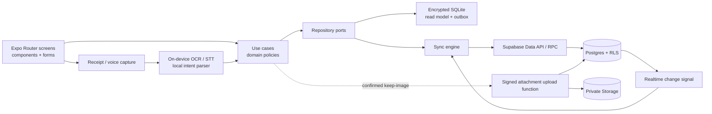

# Arsitektur Teknis Aplikasi Keuangan

**Status:** Baseline implementasi  
**Target:** Android 10/API 29+ dan iOS 16+  
**Stack utama:** Expo SDK 56, React Native, TypeScript strict, Supabase, EAS  
**Dokumen terkait:** [Model data](./04-data-model.md) dan [keamanan, privasi, kepatuhan](./05-security-privacy-compliance.md)

## 1. Tujuan dan batas sistem

Arsitektur ini ditujukan untuk aplikasi pencatatan keuangan pribadi/rumah tangga yang offline-first, aman, dan mudah diperbarui. Aplikasi mencatat serta menganalisis data yang dimasukkan pengguna; aplikasi **tidak** memegang dana, mengirim uang, mengeksekusi transaksi bank, memberi rekomendasi investasi, atau menggantikan penasihat keuangan profesional.

Kemampuan inti yang harus ditopang arsitektur:

- pencatatan pemasukan, pengeluaran, transfer internal, split transaksi, tag, dan lampiran;
- akun manual, kategori, anggaran, target tabungan, tagihan/recurring item, serta ringkasan arus kas dan kekayaan bersih;
- input melalui formulir, suara, foto struk, dan impor file;
- satu ruang pribadi atau rumah tangga bersama dengan peran anggota;
- penggunaan penuh untuk fungsi pencatatan utama saat offline, lalu sinkronisasi aman;
- pembaruan cepat melalui EAS Update untuk JavaScript dan aset yang kompatibel;
- autentikasi Google sebagai jalur utama dan Sign in with Apple sebagai pilihan setara pada iOS.

## 2. Keputusan arsitektur yang mengikat

| Area | Keputusan | Alasan dan konsekuensi |
|---|---|---|
| Aplikasi | Expo SDK 56 + React Native + TypeScript `strict` | Satu basis kode untuk iOS/Android; versi React Native mengikuti Expo SDK dan tidak dipin terpisah. |
| Navigasi | Expo Router | Route berbasis file, deep link konsisten, dan pemisahan route publik/terautentikasi. |
| Build/release | EAS Build, EAS Submit, EAS Update | Binary tetap melalui toko; OTA hanya untuk JS/aset yang kompatibel dengan runtime binary. |
| Backend | Supabase Auth, Postgres, Storage, Realtime, Edge Functions | Satu platform untuk identitas, data relasional, file privat, notifikasi perubahan, dan pekerjaan server. |
| Server state | TanStack Query v5 | Fetching, deduplikasi, retry, invalidasi, dan status asynchronous. Bukan sumber kebenaran offline. |
| UI state | Zustand | Hanya state UI lintas layar dan session façade; data finansial tidak disimpan sebagai state global duplikat. |
| Form/validasi | React Hook Form + Zod | Schema dipakai ulang di form, use case, payload RPC, dan hasil OCR/voice. |
| Data lokal | `expo-sqlite` dengan SQLCipher | Read model dan outbox terenkripsi untuk offline-first. Memerlukan development/production build, bukan Expo Go. |
| Kunci lokal | Expo SecureStore | Kunci database acak per instalasi disimpan dengan proteksi OS; tidak pernah dimasukkan ke source, log, atau backup aplikasi. |
| Uang | Postgres `bigint amount_minor` + ISO currency; bigint di domain | Nilai uang tidak pernah memakai floating-point. JSON/wire dan SQLite memakai canonical integer string; `numeric` hanya untuk FX rate/persentase. |
| Identitas command | UUID yang dibuat client | Retry offline menjadi idempoten. Gunakan UUIDv7 bila library yang diaudit tersedia; UUIDv4 tetap valid sebagai fallback. |
| Batas domain | Repository + use-case adapters | UI tidak bergantung langsung pada Supabase/SQLite/engine capture. |
| Multitenancy | `household_id` + membership + RLS | Isolasi tenant ditegakkan oleh Postgres, bukan hanya filter aplikasi. |

## 3. Gambaran sistem



Prinsip aliran dependensi: `presentation -> application -> domain`. Lapisan `infrastructure` mengimplementasikan port milik application/domain; domain tidak mengimpor Expo, Supabase, SQLite, atau SDK provider.

## 4. Struktur kode target

```text
app/
  _layout.tsx
  (public)/sign-in.tsx
  (onboarding)/...
  (app)/(tabs)/...
  (app)/financial-entries/[id].tsx
src/
  domain/
    money/ entities/ policies/ errors/
  application/
    ports/ use-cases/ dto/
  features/
    auth/ dashboard/ financial-entries/ attachments/ voice/
    budgets/ goals/ recurring/ accounts/ household/ settings/
  infrastructure/
    supabase/ sqlite/ sync/ auth/ storage/ notifications/ telemetry/
  shared/
    components/ theme/ validation/ i18n/ config/ test/
supabase/
  migrations/
  functions/
  tests/
assets/
docs/
```

Aturan modul:

1. Route hanya melakukan komposisi layar, parsing parameter, dan guard navigasi.
2. Komponen tidak memanggil `supabase-js` atau SQL secara langsung.
3. Use case menerima port seperti `FinancialEntryRepository`, `UserPreferencesRepository`, `OnDeviceReceiptRecognizer`, `OnDeviceSpeechRecognizer`, `LocalIntentParser`, `Clock`, dan `IdGenerator`.
4. Adapter SQLite melayani baca cepat dan antrean offline; adapter Supabase melayani pull, push, RPC, upload, dan auth.
5. Semua boundary data melewati Zod. `database.types.ts` hasil generate tidak diedit manual.
6. Feature hanya boleh mengimpor `domain`, `application`, dan `shared`; ketergantungan antarfungsi melalui public API feature.

## 5. Model state dan data flow

### 5.1 Pembagian state

- **SQLite terenkripsi:** sumber baca lokal untuk `user_preferences`, account, `financial_entries`, category, budget, goal, recurring item, dan status sinkronisasi.
- **Postgres:** sumber kebenaran lintas perangkat setelah command diterima server.
- **TanStack Query:** lifecycle query/mutation, invalidasi, dan orkestrasi repository; cache boleh dibuang kapan saja.
- **Zustand:** materialisasi tema saat runtime, filter sementara, household aktif, status app lock, dan draft UI non-sensitif. Nilai preference persisten tetap bersumber dari repository/SQLite, bukan Zustand.
- **React Hook Form:** state form per layar.

Data finansial tidak boleh hanya hidup di Zustand/AsyncStorage. AsyncStorage tidak digunakan untuk token, kunci, atau data keuangan mentah.

### 5.2 Command write

1. UI membuat UUID command dan memvalidasi input dengan Zod.
2. Use case menjalankan invariant domain, lalu menulis perubahan optimistis dan record `local_outbox` dalam satu transaksi SQLite.
3. Sync worker mengirim command melalui RPC Supabase dengan `idempotency_key` dan `expected_version`.
4. Postgres memeriksa JWT, membership RLS, constraint, idempotensi, dan optimistic concurrency dalam satu transaksi database.
5. Respons authoritative memperbarui SQLite; outbox ditandai selesai.
6. Kegagalan transient memakai exponential backoff + jitter. Kegagalan validasi/otorisasi tidak di-retry otomatis.

### 5.3 Read dan Realtime

Layar membaca SQLite agar cepat dan tersedia saat offline. Realtime hanya menjadi **sinyal perubahan**, bukan payload final: ketika menerima event relevan, client menjalankan `pull_changes_v1` berdasarkan cursor, menerapkan batch dalam transaksi SQLite, lalu menginvalidasi query. Pada login, resume, dan koneksi pulih, client lebih dulu mengambil `get_access_manifest_v1()` dan menghapus cache household/account yang aksesnya sudah dicabut; setelah itu pull hanya menerima payload yang lolos membership serta `account_permissions`. Ini wajib karena background execution iOS/Android tidak dijamin.

### 5.4 Preference user dan default household

- `profiles` menyimpan identitas tampilan minimum; `user_preferences` menyimpan locale, personal base currency, timezone, calendar/budget-start defaults, masking/theme, dan notification defaults milik user.
- Saat membuat household, preference boleh menjadi nilai awal. Setelah tersimpan, base currency, timezone, week start, dan budget start pada `households` authoritative untuk perhitungan ledger/report/budget/recurring bersama.
- Locale, theme, dan masking user hanya mengubah presentasi bagi user tersebut. Preference tidak pernah mengubah data atau tampilan anggota lain dan tidak boleh mematikan redaction/app-switcher/security control wajib.
- `notification_preferences` per household adalah pilihan aktual; global notification defaults hanya dipakai satu kali saat membuat row baru.
- Client boleh direct-select `user_preferences` sendiri melalui RLS. Semua mutation memakai `update_user_preferences_v1` dengan allowlisted patch, idempotency, dan `expected_version`; direct Data API write ditolak.

## 6. Sinkronisasi offline dan konflik

### 6.1 Komponen lokal

- `local_outbox`: `operation_id`, jenis entity/command, payload terenkripsi di database, dependency IDs, attempts, dan `next_attempt_at`.
- `local_sync_state`: cursor server terakhir per household dan runtime/schema lokal.
- `local_user_sync_state`: cursor user-scope serta versi `user_preferences`, terpisah dari seluruh cursor household.
- `local_conflicts`: snapshot server, perubahan lokal, alasan konflik, dan status resolusi.
- tabel read model memakai ID, `version`, `updated_at`, dan `deleted_at` yang sama dengan server.

### 6.2 Aturan sinkronisasi

- Semua create memakai ID client dan UUID idempotensi; retry command yang sama harus menghasilkan respons yang sama.
- Update/delete memakai compare-and-swap `expected_version`; mismatch menghasilkan kode konflik terstruktur, bukan overwrite diam-diam.
- Perubahan nominal, mata uang, akun, tanggal, serta split transaksi tidak pernah di-merge otomatis. Pengguna memilih versi atau membuat revisi baru.
- Perubahan set seperti tag boleh di-merge sebagai union bila tidak ada delete. `user_preferences` memakai compare-and-swap version dan rebase patch terhadap versi server; tidak ada last-write-wins diam-diam lintas perangkat.
- Delete menang terhadap update lama; tombstone mencegah record muncul kembali dari perangkat yang lama offline.
- Perubahan `account_permissions` atau membership menghasilkan directive `purge_account`/`purge_household` khusus user. Client menghapus seluruh row, attachment cache, query cache, draft, dan outbox yang tidak lagi berwenang; operasi lokal yang belum terkirim tidak boleh mencoba bypass dengan ID lama. Purge menjalankan secure delete, WAL checkpoint/truncate, dan compact/vacuum yang aman; purge seluruh user juga menghapus file database serta SecureStore key.
- Satu ledger entry hanya disinkronkan bila caller boleh membaca seluruh account lines-nya. Revoke satu account mem-purge header, semua splits/tags, attachment serta metadata capture/merchant/suggestion terkait; server tidak pernah mengirim transfer parsial, count, atau tombstone yang membocorkan account terlarang.
- Cursor server adalah `bigint` monoton. Waktu perangkat hanya metadata; urutan authoritative memakai waktu/cursor server.
- Batch push maksimal 100 operasi dan pull maksimal 500 perubahan; ukur dan sesuaikan setelah uji beban.
- Bila cursor lebih tua dari masa retensi change log, client melakukan full resync household, tidak menebak delta.
- Login/resume/reconnect menarik `pull_user_changes_v1` memakai cursor user sebelum delta household. Event hanya boleh memiliki `subject_user_id = auth.uid()`; preference user tidak pernah masuk channel, export, atau payload household.

## 7. Arsitektur Supabase

### 7.1 Akses data

- CRUD sederhana boleh melalui Supabase Data API jika RLS dan constraint cukup.
- Ledger bukan CRUD sederhana: direct mutation pada `financial_entries`/`entry_splits` ditolak dan read memakai projection/RPC yang hanya mengembalikan satu entry bila caller boleh membaca seluruh account lines; transfer tidak boleh terlihat parsial.
- Pengecualian preference: Data API hanya mengizinkan user select row `user_preferences` sendiri; insert/update/delete dilakukan RPC versioned agar allowlist, idempotency, version conflict, dan user-scope change event selalu konsisten.
- Perubahan multi-row/bernilai finansial harus melalui RPC versioned agar atomik: satu header ledger dengan account/category lines, one-header transfer dua akun, penerimaan undangan, dan rekonsiliasi.
- Function default `security invoker`. `security definer` hanya untuk helper membership atau pekerjaan administratif sempit, selalu `set search_path = ''`, nama objek fully-qualified, permission `EXECUTE` eksplisit, dan test lintas tenant.
- Mobile memakai publishable key Supabase. `service_role` tidak pernah dikirim ke app dan hanya tersedia sebagai secret Edge Function/CI yang berizin.

### 7.2 Edge Functions

| Function | Tanggung jawab | Sifat keamanan |
|---|---|---|
| `create-attachment-upload` | Setelah entry dikonfirmasi dan opsi keep-image aktif, validasi metadata lalu terbitkan upload token/path terbatas | JWT wajib, membership/account permission dicek, entry harus ada, MIME/ukuran/path diikat ke token. Tidak menjalankan OCR. |
| `dispatch-reminders` | Membuat/mengirim reminder yang sudah jatuh tempo | Dipicu scheduler server; idempoten; tidak pernah melakukan pembayaran. |
| `export-user-data` | Menyusun ekspor privat dengan masa hidup pendek | Re-auth untuk permintaan sensitif; URL bertanda tangan dan kedaluwarsa. |
| `process-account-deletion` | Menjalankan purge terkontrol dan audit minimal | Hanya job server; status terlihat oleh pemilik akun. |

Pada Phase 2, OCR struk, speech-to-text, dan intent parsing berjalan sepenuhnya di perangkat lewat adapter lokal. Tidak ada endpoint Supabase OCR/STT, upload audio/transkrip, maupun fallback cloud tersembunyi. Native module/model dipilih dan diuji sebagai bagian binary; menambah/mengganti native engine memerlukan build baru.

Cloud OCR/STT hanya kandidat Phase 5. Pengaktifannya memerlukan feature/vendor gate, explicit opt-in per penggunaan, DPA/subprocessor/region/no-training review, threat model baru, TTL terukur, serta jalur on-device/manual yang tetap tersedia. Baseline Phase 0–4 tidak membawa provider secret, cloud client, atau server schema raw capture.

### 7.3 Storage

Bucket attachment, import, dan export bersifat private. Gambar struk hanya di-upload **setelah** user mengonfirmasi entry dan mengaktifkan keep-image; bila tidak, image lokal sementara dihapus dan tidak pernah meninggalkan perangkat. Tidak ada bucket voice/audio/transcript pada Phase 2. Akses file server memakai RLS Storage atau signed URL pendek sesuai [model data](./04-data-model.md).

## 8. Autentikasi, session, dan app lock

1. Supabase Auth menjadi issuer session.
2. Google adalah tombol utama. Pada iOS, Sign in with Apple ditampilkan dengan prominensi dan kemampuan setara ketika login pihak ketiga tersedia.
3. OAuth memakai Authorization Code + PKCE di system browser. Callback hanya menerima scheme/app link yang di-allowlist; parameter `state`, verifier, issuer, dan redirect divalidasi.
4. Route callback: universal/app link HTTPS untuk produksi dengan custom scheme sebagai fallback development. Tidak ada token sensitif di log atau analytics.
5. Refresh token/session disimpan melalui adapter SecureStore. State auth di memori hanya façade; logout menghapus session, kunci cache yang relevan, dan data SQLite pengguna dari perangkat.
6. App lock biometrik/PIN perangkat bersifat opsional. Biometrik hanya membuka kunci lokal, tidak menggantikan autentikasi server atau menyimpan template biometrik.
7. Operasi berisiko—ekspor, penghapusan akun, perubahan owner—memerlukan recent authentication/step-up.

## 9. Struk dan perintah suara

### 9.1 Struk

`capture -> local temp -> on-device OCR -> local normalized draft -> user correction/confirmation -> create_financial_entry_v1 -> optional keep-image upload`

- client melakukan resize/re-encode lokal yang tidak merusak keterbacaan, menghapus EXIF, lalu menjalankan OCR on-device;
- OCR lokal menghasilkan merchant, waktu, item, pajak, diskon, total, dan confidence per field ke draft SQLCipher; raw OCR tidak dikirim atau disimpan di Supabase;
- amount/category/account tidak pernah diposting otomatis; user mengoreksi dan mengonfirmasi draft terlebih dahulu;
- bila keep-image **off** (default privacy), image/temp/preview langsung dihapus setelah confirm/cancel;
- bila keep-image **on**, server baru menerbitkan signed upload setelah entry posted ada; server memeriksa magic bytes, MIME, checksum, permission, maksimum 15 MiB, 20 megapiksel, sisi 12.000 px, dan PDF opsional lima halaman sebelum menyimpan attachment private;
- duplicate detection awal berjalan lokal dari checksum + merchant/tanggal/total dan hanya memberi warning.

### 9.2 Suara

`just-in-time permission -> on-device STT -> local strict intent parse -> clarification -> editable confirmation -> domain command`

- intent minimum: `entry_type`, `amount_minor_string`, `currency`, `occurred_at`, `account`, `category`, `merchant/note`, dan confidence;
- nilai ambigu, confidence rendah, akun tidak ditemukan, atau lebih dari satu nominal memaksa klarifikasi;
- audio, transcript, dan intent draft hanya hidup lokal (memory/temp + SQLCipher bila perlu), tidak pernah dikirim/disimpan di Supabase pada Phase 2;
- confirm membuat entry melalui RPC; cancel/timeout menghapus audio/transcript/intent lokal;
- kegagalan engine lokal menawarkan input manual, bukan cloud fallback tersembunyi.

## 10. Uang, waktu, dan lokalisasi

- Database menyimpan uang sebagai `amount_minor bigint` + ISO 4217 currency. JSON/wire dan SQLite membawa signed canonical integer string karena JSON/bridge tidak menjamin bigint; mapper mengubahnya ke TypeScript `bigint` sebelum operasi.
- `Number`, `parseFloat`, pecahan biner, dan `numeric` dilarang untuk amount. `numeric` hanya dipakai untuk exchange rate dan persentase; hasil konversi dibulatkan sekali ke minor unit dengan mode terdokumentasi.
- Domain `Money` menyimpan `minor: bigint` + currency dan memvalidasi minor unit dari tabel currency. Formatting menjadi major-unit string hanya pada presentation layer.
- Financial entry menyimpan header amount sebagai source/presentation amount. Saldo berasal dari signed account lines pada `entry_splits`; laporan kategori berasal dari positive category lines. Header amount tidak pernah dijumlahkan untuk balance.
- Transfer adalah satu header dengan source dan destination account lines; fee, bila ada, adalah expense entry terpisah yang ditautkan. Tidak ada konversi atau netting tersembunyi.
- Semua timestamp disimpan `timestamptz` UTC. Tanggal bisnis seperti periode anggaran memakai `date`; recurring rule menyimpan timezone IANA untuk menghitung due date.
- Ringkasan adalah deskriptif berdasarkan data pengguna, diberi timestamp terakhir sinkron, dan tidak diberi label sebagai nasihat.

## 11. OTA, binary, dan strategi rilis

“Auto update” modern terdiri dari dua mekanisme yang berbeda:

1. **Konten/data** berubah langsung melalui backend dan Realtime.
2. **JavaScript dan aset** dapat dikirim melalui EAS Update hanya ketika kompatibel dengan native runtime yang sudah terpasang.

Kebijakan wajib:

- gunakan `runtimeVersion` berbasis fingerprint untuk mengikat update JS ke native dependencies/config yang tepat;
- perubahan native module, config plugin, entitlement, permission native, icon/splash tertentu, Expo SDK, atau kode Swift/Kotlin/C++ memerlukan EAS Build baru dan review App Store/Play Store;
- channel terpisah `development`, `preview`, dan `production`; build production hanya menunjuk channel production;
- lakukan rollout bertahap, health check, dan rollback ke update group sebelumnya bila crash/error meningkat;
- aktifkan code signing EAS Update untuk production dan lindungi private signing material di secret manager CI;
- migration SQLite harus idempoten dan forward-only. Update JS baru harus kompatibel dengan schema lokal/runtime yang masih didukung;
- migration Postgres harus expand-contract dan mendukung sekurangnya binary production saat ini serta satu versi sebelumnya sampai adoption aman;
- emergency kill switch hanya boleh menonaktifkan fitur non-inti; pengguna tetap dapat melihat/mengekspor data mereka.

## 12. Konfigurasi dan environment

Tiga environment terisolasi: development, staging, production. Masing-masing mempunyai Supabase project, bundle/application ID, EAS channel, OAuth client, Storage bucket, dan telemetry destination berbeda.

Aturan konfigurasi:

- hanya nilai publik seperti URL Supabase dan publishable key yang boleh memakai prefix public dan masuk bundle;
- provider secret, `service_role`, signing key, webhook secret, serta credential push berada di Supabase/EAS/CI secret store;
- file `.env*` berisi nilai lokal dan di-ignore; repository hanya menyediakan `.env.example` tanpa secret;
- validasi environment dengan Zod saat startup/build dan fail closed pada production;
- rotasi secret memiliki runbook, owner, tanggal terakhir, dan uji setelah rotasi.

## 13. Ketahanan dan performa

Target awal yang harus diukur pada perangkat kelas menengah:

- buka dashboard dari cache lokal p75 <= 1 detik setelah shell tampil;
- pencatatan manual lokal p95 <= 300 ms;
- list 1.000 transaksi menggunakan pagination/keyset dan virtualized list tanpa memuat seluruh histori;
- setelah online stabil, outbox normal tersinkron p95 <= 10 detik;
- OCR/STT/parser lokal mempunyai timeout/cancellation dan fallback manual; attachment upload, import, export, serta server jobs memakai retry terbatas, idempotensi, dan status yang dapat dipulihkan;
- kegagalan backend tidak menghalangi pencatatan lokal; fitur yang membutuhkan server menjelaskan status dan menyediakan retry.

Index mengikuti pola akses `(household_id, occurred_at desc)`, foreign key, kolom RLS, status job, dan partial index untuk row aktif. Query agregat berat menggunakan RPC/view terukur; tidak memindahkan seluruh histori ke client.

## 14. Observability

- event produk dan crash tidak boleh memuat nominal minor mentah, isi catatan, transcript, gambar, token, email lengkap, atau payload OCR;
- correlation ID acak menghubungkan client command, Edge Function, dan database audit tanpa menyimpan secret;
- metrik agregat: crash-free sessions, auth success, sync lag, outbox age, conflict rate, latency/success OCR lokal, voice local parse/confirmation rate, attachment keep/upload rate tanpa konten, RPC error class, dan rollout health;
- error user-facing memakai kode stabil; detail internal hanya di log server yang di-redact;
- audit event keamanan bersifat append-only dan terpisah dari analytics produk.

## 15. Strategi pengujian dan CI/CD

### 15.1 Piramida test

- unit: bigint `Money`, minor-unit parsing/rounding, signed ledger-line invariants, tanggal recurring, local parser, policy, reducer sync, schema Zod;
- component: form, empty/error/loading state, accessibility, dark/text scaling bila didukung;
- repository contract: adapter SQLite dan Supabase memenuhi perilaku yang sama;
- database: migration dari kosong, constraint, RPC atomicity/idempotency, RLS matrix lintas user/household, query plan/index;
- integration: auth callback, on-device receipt/voice draft, confirm-before-upload keep-image, no-network capture, offline queue, conflict, logout wipe;
- E2E device: onboarding, transaksi manual, offline-online, struk, voice, budget, ekspor, dan hapus akun pada iOS/Android;
- release smoke: install binary lama, terima OTA kompatibel, migration lokal, rollback, dan cold start.

### 15.2 Gate pull request/release

1. format, lint, TypeScript strict, unit/component tests, dan dependency audit lulus;
2. migration diuji pada database ephemeral/staging dan tidak mengubah history migration;
3. test RLS membuktikan cross-tenant read/write gagal;
4. generated database types terbaru dan tidak memiliki diff setelah regenerate;
5. tidak ada secret/PII dalam bundle, source map publik, log, atau snapshot test;
6. preview build diuji di perangkat nyata; production rollout memiliki owner dan rollback point;
7. perubahan native ditandai `binary-required`; perubahan JS-only ditandai `ota-eligible` setelah fingerprint check.

## 16. Urutan implementasi kanonis

### Phase 0 — Foundation

- Scaffold Expo SDK 56 untuk Android 10/API 29+ dan iOS 16+, TypeScript strict, Expo Router, typed theme, lint/test, serta environment validation.
- Siapkan Supabase dev/staging/prod, Auth Google/Apple, deep link, session SecureStore, `profiles` + `user_preferences`, migrations, owner-only RLS/user-scope sync, generated types, SQLCipher, repository contracts, dan pipeline EAS Build/Submit/Update.
- Luluskan security gate dasar, OTA fingerprint/rollback rehearsal, telemetry redaction, dan database backup/restore drill.

### Phase 1 — Core Ledger

- Implementasikan household dasar, accounts, account permissions, categories, tags, satu header `financial_entries`, signed account/positive category `entry_splits`, entry tags, one-header transfer, exchange rates, serta summary dasar berbasis lines.
- Aktifkan outbox, pull/push RPC, idempotency, version conflict, full sync, dan offline recovery end-to-end.

### Phase 2 — Capture & Daily Use

- Tambahkan on-device receipt OCR, on-device voice STT + local parser, local encrypted drafts, optional post-confirmation keep-image attachment, recurring occurrences/reminders, notifikasi, dan import/export.
- Tidak ada endpoint/cloud fallback OCR/STT, Supabase audio/transcript, atau pre-confirmation upload. Ukur akurasi/latency lokal dan confirmation rate pada perangkat target.

### Phase 3 — Planning

- Tambahkan budgets, goals, debts, debt payments, reconciliation, net worth, dan insight deskriptif.
- Semua proyeksi menjelaskan asumsi serta tidak diposisikan sebagai nasihat finansial.

### Phase 4 — Collaboration & Global

- Lengkapi household invitation/roles, account-level permissions, multi-currency, localization, accessibility, data rights, dan account deletion.
- Account deletion memberi grace Day 7 sejak original request lalu purge active data; salinan backup yang memuat user wajib kedaluwarsa paling lambat Day 30 sejak request yang sama. Recovery soft-delete financial entry 30 hari adalah alur terpisah dan tidak menunda purge akun.
- Validasi concurrency serta tenant isolation pada skenario banyak perangkat/anggota.

### Phase 5 — Optional AI & Bank

- Setelah evaluasi terpisah, pertimbangkan cloud OCR/STT/insight AI dan koneksi data bank read-only melalui adapter/provider yang disetujui.
- Cloud capture memerlukan explicit opt-in, vendor/feature gate, DPA/subprocessor/region/no-training review, TTL dan deletion test; tidak boleh menjadi fallback tersembunyi. Fase ini bukan syarat peluncuran.
- Tidak boleh mengeksekusi transfer/pembayaran, menyimpan credential bank, atau memberi nasihat teregulasi tanpa scope, legal, security, consent, dan threat-model review baru.

## 17. Definition of Done arsitektur

- [ ] Tidak ada UI yang mengakses Supabase/SQL/provider secara langsung.
- [ ] Semua amount persisted memakai `amount_minor bigint` + currency, TypeScript `bigint`, dan wire/SQLite integer string; hanya rate/persentase boleh `numeric`.
- [ ] Balance hanya berasal dari signed account `entry_splits`; category report hanya positive category lines; header amount tidak pernah menjadi sumber balance.
- [ ] Core flow dapat create/read/edit/delete secara offline dan tersinkron idempoten.
- [ ] Konflik nominal tidak pernah tertimpa diam-diam.
- [ ] Semua tenant table dan Storage path mempunyai test RLS positif/negatif.
- [ ] `user_preferences` selalu one-to-one dengan auth user, hanya owner dapat direct-select/mutate via RPC, tersinkron dengan cursor user terpisah, dan tidak muncul pada household/member APIs.
- [ ] Household calculations memakai household defaults; preference user hanya memengaruhi presentasi/default awal.
- [ ] Pencabutan membership/account permission menghapus cache lokal pada resume/reconnect dan sync RPC tidak pernah mengirim payload account tersembunyi.
- [ ] Google dan Apple iOS berhasil pada build development serta production callback.
- [ ] Kunci SQLite tidak terdapat di source/log dan cache tidak dapat dibaca tanpa kunci.
- [ ] Phase 2 receipt/voice sepenuhnya lokal sampai konfirmasi; tidak ada network capture, server OCR/STT endpoint, audio/transcript bucket, atau hidden cloud fallback.
- [ ] Attachment receipt hanya dapat di-upload setelah entry dikonfirmasi dan keep-image aktif.
- [ ] Attachment receipt menolak file di atas 15 MiB/20 MP/12.000 px (PDF opsional > lima halaman) dan tidak pernah mempunyai server-side unlinked draft.
- [ ] Account deletion purge dimulai setelah grace Day 7 dan backup expiry maksimal Day 30 sejak original request; soft-delete entry 30 hari tetap terpisah.
- [ ] OTA kompatibel berhasil; perubahan native ditolak oleh gate OTA.
- [ ] Ekspor serta penghapusan akun berjalan end-to-end dan dapat diaudit.
- [ ] Dokumentasi operasional, rollback, incident response, dan pemulihan tersedia.

## 18. Referensi implementasi

- [Expo: EAS Update dan build integration](https://docs.expo.dev/build/updates/)
- [Expo: runtime versions](https://docs.expo.dev/eas-update/runtime-versions/)
- [Expo: fingerprint](https://docs.expo.dev/versions/latest/sdk/fingerprint/)
- [Expo: SQLite](https://docs.expo.dev/versions/latest/sdk/sqlite/)
- [Expo: SecureStore](https://docs.expo.dev/versions/latest/sdk/securestore/)
- [Supabase: Expo React Native social auth](https://supabase.com/docs/guides/auth/quickstarts/with-expo-react-native-social-auth)
- [Supabase: Google Auth untuk React Native](https://supabase.com/docs/guides/auth/social-login/auth-google?platform=react-native)
- [Supabase: Row Level Security](https://supabase.com/docs/guides/database/postgres/row-level-security)
- [Supabase: Storage access control](https://supabase.com/docs/guides/storage/security/access-control)
