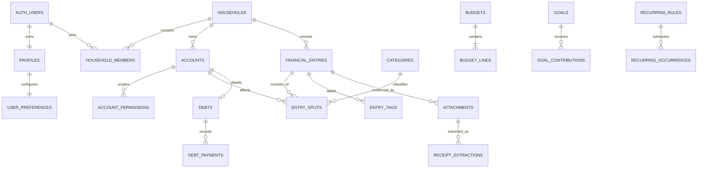

# Model Data Supabase dan Offline Cache

**Status:** Baseline schema siap diturunkan menjadi migration  
**Database authoritative:** Supabase Postgres  
**Cache perangkat:** Expo SQLite + SQLCipher  
**Dokumen terkait:** [Arsitektur teknis](./03-technical-architecture.md) dan [keamanan, privasi, kepatuhan](./05-security-privacy-compliance.md)

## 1. Tujuan dan source of truth

Model ini mendukung pencatatan keuangan pribadi/rumah tangga, bukan pemindahan dana atau pemberian nasihat keuangan. `financial_entries` adalah **satu-satunya source of truth untuk catatan pemasukan, pengeluaran, transfer, dan adjustment**. Tidak ada tabel `transactions` paralel.

### 1.1 Registry tabel server fisik kanonis

Registry ini exhaustif untuk nama tabel aplikasi di Supabase. Migration baru tidak boleh memperkenalkan nama fisik di luar registry sebelum dokumen ini, feature owner, RLS, retensi, dan klasifikasinya diperbarui. “Primary” berarti source of truth domain non-ledger; hanya baris berkelas **canonical ledger** yang menjadi sumber uang bergerak/saldo transaksi.

| Owner / consumer | Fase | Tabel server fisik | Klasifikasi dan batas source of truth |
|---|---:|---|---|
| F01 / F02 | 0–1 | `profiles`, `user_preferences` | Primary identitas aplikasi dan preferensi user; bukan data household/ledger. |
| F01 / F21 / F24 | 0–5 | `user_consents` | Append-only evidence consent/version; tidak menyimpan payload finansial. |
| F01 / F19 / F24 | 0–4 | `device_installations` | Primary metadata instalasi/token push tersanitasi; session token tetap di Auth/secure storage. |
| F23 / F01 | 0–4 | `households`, `household_members`, `household_invitations`, `account_permissions` | Primary tenancy, membership, invite, dan account access. |
| F03 | 1 | `accounts`, `asset_valuations` | Primary metadata account/opening balance dan histori valuasi; saldo berjalan tetap `opening_balance_minor +` account lines posted, bukan `asset_valuations`. |
| F04 | 1 | `categories`, `tags`, `merchants`, `classification_rules`, `classification_rule_amount_conditions` | Primary reference/classification; rule hanya memberi saran. |
| F04 / F05 | 1 | `entry_tags` | Relationship ledger–tag; tidak menyimpan amount. |
| F05 / semua fitur uang | 1–5 | `financial_entries`, `entry_splits` | **Canonical ledger tunggal**. Header menyimpan lifecycle/clearing; signed account lines posted adalah satu-satunya delta saldo dan category lines sumber reporting. |
| F05 / F18 | 0–4 | `mutation_deduplication` | Workflow idempotency; bukan ledger. |
| F06 | 1 | `transfers`, `balance_adjustment_details`, `ledger_period_locks` | Relationship/detail/control; transfer/adjustment tetap diposting sekali lewat ledger kanonis. |
| F07 | 2 | `attachments`, `receipt_extractions`, `receipt_extraction_items` | Primary metadata hasil yang sudah dikonfirmasi; gambar opsional sesudah confirm, raw OCR/draft tidak pernah ke server pada Phase 2. |
| F08 | 2 | `entity_aliases` | Primary alias terstruktur yang disetujui user; tidak ada tabel voice/audio/transcript server pada Phase 2. |
| F09 | 2 | `dashboard_preferences`, `daily_financial_snapshots` | Preferensi + **derived/rebuildable cache** dengan permission-scope hash. |
| F10 | 3 | `report_presets`, `account_balance_snapshots` | Preferensi + **derived/rebuildable cache**; report menghitung ulang dari ledger/rate kanonis. |
| F11 | 2–3 | `budgets`, `budget_lines`, `budget_line_categories`, `budget_periods`, `budget_line_periods`, `budget_adjustments` | Primary planning/allocation/workflow; actual tetap dari ledger. |
| F11 | 2–3 | `budget_line_period_summaries` | **Derived/rebuildable cache**; tidak menjadi actual/available source of truth. |
| F12 | 3 | `goals`, `goal_account_links`, `goal_contributions`, `goal_target_history`, `goal_milestone_events` | Primary planning/link/event; kontribusi ledger merujuk entry split, tidak menduplikasi saldo. |
| F13 | 2–3 | `recurring_rules`, `recurring_occurrences`, `recurring_rule_versions`, `recurring_reminders` | Primary schedule/template/workflow; occurrence tidak menjadi transaksi sampai RPC ledger berhasil. |
| F03 / F14 | 1–3 | `debts`, `loan_terms`, `debt_ledger_entries`, `debt_payments`, `debt_statements` | Primary metadata/link/statement; amount aktual dan pembayaran dibaca dari entry/split tertaut, bukan ledger kedua. |
| F14 | 3 | `debt_schedule_entries` | **Derived/rebuildable cache** untuk amortisasi/skenario. |
| F15 | 3 | `calendar_preferences`, `forecast_scenarios`, `forecast_overrides` | Preferensi dan primary scenario/override; bukan fakta saldo. |
| F15 | 3 | `forecast_cache` | **Derived/rebuildable cache** dengan source/formula/permission version. |
| F16 | 1–3 | `saved_searches`, `review_items`, `duplicate_links`, `reconciliation_sessions`, `reconciliation_session_items` | Preferensi/workflow/link/snapshot; review atau rekonsiliasi tidak menulis uang di luar RPC ledger. |
| F17 | 4 | `currencies`, `exchange_rates` | Reference immutable/as-of; rate memakai decimal, seluruh nominal memakai minor-unit bigint. |
| F18 | 0–4 | `sync_changes` | Append-only change feed/tombstone; Realtime hanya hint dan row domain tetap source of truth. |
| F19 | 2–4 | `notification_preferences`, `notification_jobs`, `notification_deliveries`, `notification_snoozes` | Preferensi/workflow/delivery metadata tersanitasi; push payload tidak membawa nominal/detail. |
| F20 | 1–4 | `import_jobs`, `import_rows`, `data_export_jobs` | Staging/workflow sementara; import row tidak menjadi ledger sebelum commit RPC. |
| F21 | 5 | `ai_sessions`, `ai_messages`, `ai_runs`, `ai_feedback`, `insight_snapshots` | Optional opt-in workflow/evidence/**derived snapshot**; tool AI read-only terhadap ledger dan bukan nasihat finansial. |
| F22 | 5 | `financial_connections`, `external_accounts`, `provider_sync_cursors`, `provider_events`, `external_transactions_staging`, `reconciliation_links`, `connection_consents` | Optional server-only connection/staging/workflow; token tidak client-readable dan staging bukan ledger. |
| F24 / lintas fitur | 0–4 | `user_security_preferences`, `audit_events`, `account_deletion_requests` | Primary security preference, append-only audit, dan deletion workflow. |

Semua tabel berisi data household membawa `household_id` dan, bila menyentuh account, wajib lolos `account_permissions`/`private.can_access_account`; `user_id` hanya boleh menjadi scope tunggal untuk preferensi atau hak data user. Nominal persisten memakai `*_minor bigint` + `currency_code`; hanya FX rate/rasio/persentase boleh `numeric`.

### 1.2 Artefak yang sengaja bukan tabel server aplikasi

| Owner | Nama kanonis | Lokasi / status |
|---|---|---|
| F02 | `device_preferences`, `currency_catalog` | SQLCipher device-only dan katalog bundled/read-only; katalog server kanonis adalah `currencies`. |
| F07 | `local_receipt_capture_sessions` | SQLCipher + encrypted file sandbox, device-only; raw image/OCR draft purge saat confirm/cancel atau maksimum 24 jam. |
| F08 | `local_voice_capture_sessions` | SQLCipher device-only; audio/transcript/raw intent tidak disinkron, tanpa tabel `voice_capture_sessions` server. |
| F10 | `report_export_audit` | Device-only analytics-opt-in maksimum 7 hari; tidak dibuat di Supabase. |
| F18 | `local_entities`, normalized feature tables, `local_outbox`, `local_sync_state`, `local_user_sync_state`, `local_conflicts`, `local_drafts`, `local_schema_migrations`, `local_sync_leases` | SQLite/SQLCipher saja. `local_outbox` memakai `scope_type=user|household`, `scope_id`, dan nullable `household_id`. |
| F07 / F20 | `storage.objects` dan bucket private | Tabel/platform-managed Supabase Storage, bukan migration tabel aplikasi; policy tetap mengikat parent + account permission. |
| F09 / F10 | `account_balances_v`, `cashflow_daily_v`, `net_worth_v`, `budget_progress_v` | View/RPC derived, bukan tabel fisik atau source of truth. |

## 2. Konvensi schema

### 2.1 Schema, ID, waktu, dan versi

- Tabel aplikasi berada di schema `public`; helper sensitif berada di schema `private`. `auth.users`, `storage.buckets`, dan `storage.objects` dikelola Supabase.
- Aktifkan `pgcrypto`; `pg_trgm` hanya jika pencarian merchant membutuhkannya setelah profiling.
- Nama SQL selalu `snake_case` lowercase.
- Entity sinkron memakai `id uuid primary key`; client membuat UUID sebelum write. UUIDv7 direkomendasikan, UUIDv4 diterima sebagai fallback.
- Timestamp event memakai `timestamptz` UTC; tanggal bisnis/periode memakai `date`; recurrence menyimpan timezone IANA.
- Record mutable memakai `created_at`, `updated_at`, `version bigint default 1`, dan `deleted_at` bila soft delete berlaku. Trigger server mengontrol waktu dan increment versi.
- Setiap tenant parent mempunyai `unique (household_id, id)`. Child membawa `household_id` dan composite foreign key agar relasi lintas tenant gagal pada constraint, tidak hanya RLS.
- Pada daftar field di bawah, ID adalah `uuid`, label/status/kode/note adalah `text`, waktu kejadian adalah `timestamptz`, dan tanggal kalender adalah `date` kecuali tipe lain ditulis eksplisit. Semua foreign key tetap dideklarasikan lengkap di migration dan diindeks.

Common tenant columns:

```sql
id uuid primary key,
household_id uuid not null,
created_by uuid references auth.users(id) on delete set null,
created_at timestamptz not null default now(),
updated_at timestamptz not null default now(),
version bigint not null default 1 check (version > 0),
deleted_at timestamptz null
```

### 2.2 Nominal yang aman

- Semua uang persisten disimpan sebagai integer unit minor: kolom berakhiran `_minor bigint` dan selalu berpasangan dengan `currency_code`. Contoh IDR 12.500 adalah `12500`; USD 12,50 adalah `1250`.
- JSON/RPC mengirim bigint sebagai canonical signed integer string (`^-?[0-9]+$`) agar tidak melewati batas aman JavaScript. Domain client memakai branded `MoneyMinorString` dan `bigint`; `Number`, float, `parseFloat`, PostgreSQL `money`, `real`, dan `double precision` dilarang untuk uang.
- `currency_code text` mereferensikan `currencies(code)` dan memenuhi `^[A-Z]{3}$`; `currencies.minor_unit` dipakai hanya untuk parsing/formatting input manusia, bukan menentukan skala kolom.
- `numeric(24,10)` hanya untuk kurs dan `numeric(9,6)` hanya untuk rasio/persentase. Konversi FX melakukan pembulatan sekali pada boundary use case dengan mode terdokumentasi, lalu menyimpan hasil `_minor bigint`.
- Agregasi nominal dilakukan pada `bigint` di Postgres, dengan overflow guard, dan hasil RPC di-cast ke integer string. Migration/constraint menolak nilai di luar rentang bigint dan pasangan amount/currency yang tidak lengkap.

### 2.3 Status

Gunakan `text` + `check`, bukan enum PostgreSQL, agar perubahan expand-contract lebih aman. Nilai awal:

- role household: `owner | admin | member | viewer`;
- lifecycle entry: `draft | posted | void`;
- clearing entry: `pending | cleared | reconciled`;
- type entry: `income | expense | transfer | balance_adjustment | refund | reversal`;
- source: `manual | receipt | voice | import | recurring`;
- status job: `queued | processing | needs_review | completed | failed | cancelled`.

## 3. Relasi inti



## 4. RLS dan peran

| Aksi | owner | admin | member | viewer |
|---|---:|---:|---:|---:|
| Read data household/account yang diizinkan | Ya | Ya | Ya | Ya |
| Write finance/planning | Ya | Ya | Ya | Tidak |
| Kelola invite/member non-owner | Ya | Ya | Tidak | Tidak |
| Transfer ownership/delete household | Ya | Tidak | Tidak | Tidak |
| Read audit keamanan | Ya | Ya | Tidak | Tidak |

`accounts.access_mode` menentukan baseline. Mode `household` memakai ceiling role (owner/admin=`manage`, member=`write`, viewer=`read`); mode `restricted` menolak non-owner tanpa grant eksplisit. `account_permissions` tidak pernah menaikkan user di atas ceiling role dan `deny` selalu menang. Owner selalu `manage` agar household tidak kehilangan kendali. Helper:

- `private.is_household_member(p_household_id uuid)`;
- `private.can_household_write(p_household_id uuid)`;
- `private.can_access_account(p_household_id uuid, p_account_id uuid, p_action text)`;
- `private.has_household_role(p_household_id uuid, p_roles text[])`.

Helper dimiliki role non-login, `security definer`, `stable`, `set search_path = ''`, memakai nama fully-qualified, dan `execute` hanya untuk `authenticated`. Policy memakai `(select auth.uid())`/`(select private.helper(...))` untuk evaluasi stabil. Setiap FK dan kolom RLS wajib berindeks.

## 5. Tabel identitas dan tenancy

### 5.1 `profiles`

- **Field:** `id uuid PK/FK auth.users(id) on delete cascade`, `display_name text`, `avatar_path text`, `onboarding_completed_at`, `created_at`, `updated_at`, `version`.
- **Constraint/index:** display name trim 1–80; PK dan optional index `lower(display_name)` untuk scoped member display. Preference tidak diduplikasi di profile.
- **RLS:** user read/update profile sendiri. View `household_member_profiles_v` hanya membuka ID, nama, dan avatar bagi household bersama.

### 5.2 `user_preferences`

- **Field:** `user_id uuid PK/FK profiles(id) on delete cascade`, `locale text not null default 'id-ID'`, `base_currency_code text not null default 'IDR' FK currencies`, `timezone text not null default 'UTC'`, `week_start smallint not null default 1`, `budget_month_start_day smallint not null default 1`, `theme text not null default 'system'`, `mask_amounts_default boolean not null default false`, `notification_preview_mode text not null default 'hidden'`, `default_budget_alerts boolean not null default true`, `default_bill_reminders boolean not null default true`, `default_goal_updates boolean not null default true`, `default_weekly_summary boolean not null default false`, `preference_schema_version integer not null default 1`, `created_at`, `updated_at`, `version bigint not null default 1`.
- **Constraint/index:** one-to-one profile; locale BCP 47 dan timezone IANA divalidasi boundary; week start 0–6; budget start 1–28; theme `system | light | dark`; notification preview `hidden | generic` dan tidak pernah memuat nominal; schema/version positif. PK cukup untuk query owner.
- **Lifecycle:** `private.handle_new_user` membuat `profiles` lalu tepat satu preference row dalam transaksi yang sama dengan `on conflict do nothing`, fixed empty `search_path`, dan input metadata allowlist. Onboarding wajib meminta user mengonfirmasi locale, detected timezone, dan base currency sebelum membuat household pertama; default UTC tidak boleh diam-diam menjadi tanggal bisnis. Global notification defaults hanya men-seed `notification_preferences` saat user masuk/membuat household baru; perubahan berikutnya tidak menimpa pilihan per-household. Biometric app lock dan key material tetap device-local, bukan kolom server.
- **RLS/API:** hanya `user_id = (select auth.uid())` boleh select. Direct insert/update/delete dari Data API ditolak; perubahan melalui `update_user_preferences_v1` dengan allowlisted patch, expected version, dan idempotency. Preference tidak pernah tampil di member view, household export milik user lain, Realtime household, atau aggregate.

### 5.3 `households`

- **Field:** common tenant fields tanpa `household_id`, plus `name`, `base_currency_code`, `timezone text`, `week_start smallint`, `budget_month_start_day smallint`, `status`.
- **Constraint/index:** nama 1–80; timezone IANA; week start 0–6; budget start 1–28; status `active | pending_deletion`; minimal satu owner dijaga RPC/constraint trigger; index active `created_by`.
- **RLS:** member read; owner/admin update; delete workflow hanya owner dengan recent-auth.

**Batas default:** `user_preferences` mengontrol locale, format, masking, tampilan kalender, serta default saat user membuat household baru. Setelah household terbentuk, `households.base_currency_code`, timezone, week start, dan budget month start adalah authoritative untuk ledger, reporting, recurring schedule, serta budget bersama. Preference user tidak boleh mengubah perhitungan household atau tampilan anggota lain.

### 5.4 `household_members`

- **Field:** `household_id`, `user_id`, `role`, `status`, `joined_at`, `left_at null`, `invited_by`, `updated_at`, `version`; PK `(household_id,user_id)`.
- **Constraint/index:** role allowlist; status `active | suspended | left`; hanya active memberi akses; sole owner tidak dapat dikeluarkan/diturunkan; indexes `(user_id,status,household_id)` dan `(household_id,status,role)`.
- **RLS:** member household read; owner/admin mengelola non-owner; transfer ownership melalui RPC atomik.

### 5.5 `household_invitations`

- **Field:** `id`, `household_id`, `email_normalized_hash`, `role`, `token_hash`, `expires_at`, `accepted_at`, `revoked_at`, `invited_by`, `created_at`.
- **Constraint/index:** token mentah tidak disimpan; role `admin | member | viewer`; unique partial invite aktif `(household_id,email_normalized_hash)`; unique `token_hash`; index expiry.
- **RLS:** owner/admin melihat metadata/revoke; create/accept via RPC/Edge Function. Hash token tidak dipilih client.

### 5.6 `user_consents`

- **Field:** `id`, `user_id`, `document_type`, `document_version`, `action`, `locale`, `recorded_at`, `source`, `metadata_redacted jsonb`.
- **Constraint/index:** append-only; action `granted | withdrawn | acknowledged`; index `(user_id,document_type,recorded_at desc)`.
- **RLS:** user read consent sendiri; insert lewat RPC; update/delete ditolak.

### 5.7 `device_installations`

- **Field:** `id`, `user_id`, `platform`, `push_token`, `app_version`, `runtime_version`, `locale`, `timezone`, `last_seen_at`, `revoked_at`, timestamps.
- **Constraint/index:** platform `ios | android`; unique partial push token aktif; indexes `(user_id,revoked_at)` dan cleanup `last_seen_at`.
- **RLS:** user CRUD instalasi sendiri; dispatcher server membaca minimum.

## 6. Referensi, account, dan permission

### 6.1 `currencies`

- **Field:** `code text PK`, `name`, `symbol`, `minor_unit smallint`, `is_active`, `updated_at`.
- **Constraint/index:** code tiga huruf uppercase; minor unit 0–4; `(is_active,code)`.
- **RLS:** authenticated read; migration/service admin write.

### 6.2 `accounts`

- **Field:** common tenant columns + `name`, `type`, `balance_kind`, `access_mode text default 'household'`, `currency_code`, `opening_balance_minor bigint`, `opening_balance_at date`, `institution_label`, `last_four`, `include_in_net_worth`, `archived_at`, `sort_order`.
- **Constraint:** type `cash | bank | e_wallet | credit_card | investment | loan | receivable | other`; balance kind `asset | liability`; access mode `household | restricted`; last four tepat empat digit bila ada; tidak menyimpan credential bank.
- **Index:** unique partial `(household_id,lower(name)) where deleted_at is null`; `(household_id,archived_at,sort_order)`; `(household_id,currency_code)`.
- **RLS:** member read kecuali dibatasi `account_permissions`; writer household mutate bila memiliki `write/manage`. Account ber-entry hanya di-archive.

### 6.3 `account_permissions`

- **Field:** `household_id`, `account_id`, `user_id`, `permission text`, `granted_by`, `created_at`, `updated_at`; PK `(account_id,user_id)`.
- **Constraint:** permission `read | write | manage | deny`; account dan user satu household; permission efektif adalah minimum antara grant dan ceiling household role; restricted account tanpa grant berarti deny; owner selalu `manage` dan tidak dapat dideny.
- **Index:** `(user_id,household_id,permission)`, `(household_id,account_id)`.
- **RLS:** user boleh melihat grant sendiri; owner/admin melihat seluruh grant; hanya owner/admin mengubahnya. Helper account menghindari recursive RLS.

### 6.4 `categories`

- **Field:** common tenant columns + `parent_id`, `kind`, `name`, `icon_key`, `color_token`, `is_system`, `sort_order`.
- **Constraint/index:** parent composite FK satu household dan kind sama; depth maksimum dua; kind `income | expense`; unique partial `(household_id,kind,lower(name))`; index parent/sort.
- **RLS:** member read; writer role mutate.

### 6.5 `tags`

- **Field:** common tenant columns + `name`, `color_token`, `sort_order`.
- **Constraint/index:** nama 1–40; unique partial `(household_id,lower(name)) where deleted_at is null`.
- **RLS:** member read; writer mutate.

### 6.6 `merchants`

- **Field:** common tenant columns + `name`, `normalized_name`, `visibility_scope text`, `account_id null`, `default_category_id`, `logo_path`.
- **Constraint/index:** scope `household | account`; account wajib hanya untuk account scope; category/account composite FK; normalized server-side; unique partial `(household_id,normalized_name) where visibility_scope = 'household'` serta `(household_id,account_id,normalized_name)` untuk account scope.
- **RLS:** household-scoped merchant mengikuti membership; account-scoped merchant mengikuti `can_access_account`. Merchant yang berasal dari OCR/import/restricted entry default account-scoped dan hanya dapat dipromosikan menjadi household-wide lewat aksi eksplisit owner/admin. `last_used_at`, usage count, dan default suggestion tidak disimpan sebagai sinyal global; semuanya dihitung dari entry yang caller boleh baca.

## 7. Ledger kanonis

### 7.1 `financial_entries`

- **Field:** common tenant columns + `entry_type`, `lifecycle_status`, `clearing_status`, `occurred_at`, `business_date`, `amount_minor bigint`, `currency_code`, `reporting_amount_minor bigint null`, `reporting_currency_code null`, `exchange_rate_id null`, `merchant_id null`, `note null`, `source`, `source_metadata jsonb null`, `related_entry_id null`, `reversal_of_entry_id null`, `confirmed_at null`, `cleared_at null`, `reconciled_at null`, `external_reference null`.
- **Makna header:** satu kejadian keuangan selalu satu header, termasuk transfer. `amount_minor > 0` adalah nominal sumber/presentasi untuk UI, kuitansi, deduplikasi, dan audit; kolom ini **bukan** sumber saldo atau agregasi. Saldo account hanya berasal dari signed account lines di `entry_splits`; laporan kategori hanya berasal dari positive category lines.
- **Constraint:** type `income | expense | transfer | balance_adjustment | refund | reversal`; lifecycle `draft | posted | void`; clearing `pending | cleared | reconciled`; source allowlist; amount positif; reporting amount/currency keduanya null atau isi; merchant/rate/related/reversal satu household; note maksimum 2.000 karakter. `reconciled_at` wajib hanya saat reconciled, `cleared_at` wajib untuk cleared/reconciled, posted wajib `confirmed_at`, dan void immutable kecuali metadata audit.
- **Index:** `(household_id,business_date desc,id) where deleted_at is null`; `(household_id,lifecycle_status,clearing_status,updated_at)`; `(household_id,merchant_id,occurred_at desc)`; `(household_id,entry_type,business_date)`; `(household_id,related_entry_id) where related_entry_id is not null`; `(created_by,created_at desc)`; partial unique `reversal_of_entry_id where lifecycle_status <> 'void'` bila hanya satu reversal aktif diizinkan.
- **RLS/API:** base table tidak diberi direct mutation grant. Read projection/RPC hanya mengembalikan header bila caller active member dan memiliki `read` pada **semua** account lines aktif; draft tanpa account line hanya creator. Create/update/void melalui RPC agar header, lines, tag, audit, sync, dan invariant atomik. Realtime hanya sinyal perubahan terfilter, bukan payload ledger.

### 7.2 `entry_splits`

- **Field:** common tenant columns + `financial_entry_id`, `line_type text`, `line_role text`, `account_id null`, `category_id null`, `amount_minor bigint`, `currency_code`, `reporting_amount_minor bigint null`, `reporting_currency_code null`, `exchange_rate_id null`, `sort_order integer`, `note null`.
- **Makna:** `line_type='account'` menyimpan delta saldo signed dalam currency account; server use case, bukan UI, menetapkan tanda. Pada asset account, masuk menambah (+) dan keluar mengurangi (-); pada liability account, kewajiban bertambah (+) dan pembayaran mengurangi (-). `line_type='category'` selalu menyimpan nominal positif; income menambah income, expense menambah expense, refund mengurangi expense terkait, reversal menegasikan arah entry asal, sedangkan transfer/balance adjustment dikecualikan dari cash-flow. Header amount tidak pernah dijumlahkan ke saldo atau laporan kategori.
- **Constraint umum:** tepat satu dari `account_id`/`category_id` terisi sesuai line type; parent/reference satu household; account line harus non-zero dan currency sama dengan account; category line harus `amount_minor > 0` dan currency sama dengan header; reporting amount/currency/rate konsisten; sort order unik per entry. Deferred constraint trigger memvalidasi seluruh entry sebelum commit.
- **Invariant posted:** income/expense/refund/reversal memiliki minimal satu account line dan category lines positif yang totalnya sama dengan header presentation amount bila memakai currency header; `balance_adjustment` memiliki account line dan category opsional; reversal mereferensi posted original dan menegasikan seluruh account-line effects original. Transfer mempunyai tepat dua account lines (`line_role='source'` negatif dan `destination` positif), dua account berbeda, tanpa category line; header currency/amount sama dengan currency/absolute amount source line. Untuk currency berbeda, destination amount memakai currency destination dan pasangan reporting/rate tervalidasi. Fee transfer selalu financial entry `expense` terpisah dengan `related_entry_id` ke transfer.
- **Index:** `(household_id,financial_entry_id,sort_order) where deleted_at is null`; `(household_id,account_id,financial_entry_id) where line_type='account' and deleted_at is null`; `(household_id,category_id,financial_entry_id) where line_type='category' and deleted_at is null`.
- **RLS/API:** read mengikuti aturan all-account parent; denied account menyembunyikan header dan seluruh lines, bukan menghasilkan transfer parsial. Direct mutation ditolak; RPC entry/transfer mengunci parent, memvalidasi permission setiap account, lalu menjalankan deferred invariant.

### 7.3 `transfers`

- **Field:** `household_id`, `entry_id uuid primary key`, `source_split_id uuid unique`, `destination_split_id uuid unique`, `effective_rate numeric null`, timestamps.
- **Makna:** metadata one-to-one untuk header `entry_type='transfer'`. Nominal/currency selalu berasal dari dua account lines di `entry_splits`; `transfers` tidak menjadi sumber amount, saldo, atau cash-flow paralel. Satu-satunya relasi fee adalah entry expense terpisah dengan `financial_entries.related_entry_id = transfers.entry_id`.
- **Constraint/index:** entry dan kedua split berada pada household yang sama; source/destination split wajib account lines parent yang sama dengan role `source` dan `destination`; effective_rate hanya untuk FX dan immutable setelah posted.
- **RLS/API:** mengikuti all-account permission parent transfer; direct mutation ditolak dan hanya dibuat/diubah oleh RPC transfer.

### 7.4 `entry_tags`

- **Field:** `household_id`, `financial_entry_id`, `tag_id`, `created_by`, `created_at`; PK `(financial_entry_id,tag_id)`.
- **Constraint/index:** composite FK memastikan entry/tag satu household; index `(household_id,tag_id,financial_entry_id)`.
- **RLS:** mengikuti all-account permission parent entry; writer insert/delete hanya melalui command terotorisasi. Offline merge boleh set union kecuali explicit remove lebih baru.

### 7.5 Saldo dan agregasi

Saldo account = `accounts.opening_balance_minor + sum(entry_splits.amount_minor)` untuk account lines dengan parent `lifecycle_status='posted'` sampai waktu tertentu; `clearing_status` hanya memisahkan saldo pending/cleared/reconciled dan tidak mengubah signed effect. Tidak ada `current_balance` mutable di account. View/RPC:

- `account_balances_v`: balance per account/currency;
- `cashflow_daily_v`: category lines positif dengan arah dari type; transfer dan balance adjustment dikecualikan, refund/reversal mengurangi kelompok asal;
- `net_worth_v`: asset dikurangi liability dengan kurs eksplisit;
- `budget_progress_v`: actual dari entry/split posted.

View memakai `security_invoker = true` atau hanya diakses melalui RPC ber-membership. Semua hasil amount adalah canonical integer string.

Semua view/RPC agregat menerapkan `can_access_account(...,'read')` sebelum agregasi. User yang dibatasi tidak boleh menerima total, count, merchant/category breakdown, budget actual, goal progress, net worth, atau sinyal keberadaan dari account tersembunyi. Planned budget yang memang household-wide boleh terlihat, tetapi actual/remaining dihitung hanya dari entry yang boleh dibaca dan response menandai `is_partial_due_to_permissions = true`.

## 8. Attachment, struk, suara, dan impor

### 8.1 `attachments`

- **Field:** common tenant columns + `uploaded_by uuid not null`, `financial_entry_id uuid not null`, `kind`, `storage_bucket`, `storage_path`, `original_filename_sanitized`, `mime_type`, `size_bytes bigint`, `sha256`, `width`, `height`, `page_count`, `status`, `uploaded_at`, `confirmed_at`.
- **Lifecycle:** gambar/PDF struk tetap lokal selama OCR dan review. Hanya setelah entry dikonfirmasi dan user memilih `keep_image=true`, server membuat row attachment yang sudah tertaut lalu menerbitkan signed upload. Phase 2 tidak mempunyai server attachment draft, `draft_account_id`, atau object unlinked.
- **Constraint:** kind `receipt | supporting_document | import_source`; path canonical; receipt menerima JPEG/PNG/WebP maksimum 15 MiB, 20 megapiksel, serta sisi maksimum 12.000 px; PDF opsional maksimum 15 MiB/lima halaman; HEIC dikonversi lokal sebelum upload; checksum 64 hex; parent/entry satu household.
- **Index:** `(uploaded_by,status,created_at)`; `(household_id,financial_entry_id)`; duplicate candidate `(household_id,sha256)`.
- **RLS:** akses mengikuti all-account permission parent entry. Direct insert/link ditolak; `create_attachment_upload_v1` memvalidasi uploader, parent `lifecycle_status='posted'` dengan `confirmed_at`, permission, metadata, dan quota sebelum membuat row + signed upload. Storage policy memakai aturan sama tanpa household-wide fallback.

### 8.2 `receipt_extractions`

- **Field:** `id`, `household_id`, `financial_entry_id uuid not null`, `attachment_id uuid null`, `capture_mode text not null default 'on_device'`, `recognizer_version`, `schema_version`, `merchant_name null`, `purchased_at null`, `currency_code`, `subtotal_minor bigint null`, `tax_minor bigint null`, `discount_minor bigint null`, `total_minor bigint`, `field_confidence jsonb null`, `confirmed_by`, `confirmed_at`, timestamps, `version`.
- **Makna:** hanya data terstruktur yang telah dikoreksi/dikonfirmasi user yang persisten. Raw image, raw OCR text, bounding boxes, dan candidate draft tetap terenkripsi lokal lalu dihapus pada confirm/cancel/timeout; tidak pernah dikirim ke Supabase pada Phase 2. Attachment boleh null ketika user tidak menyimpan gambar.
- **Constraint/index:** capture mode Phase 2 hanya `on_device`; entry/attachment satu household; attachment bila ada bertipe receipt dan menunjuk entry sama; monetary fields non-negatif; confidence values 0–1; unique active `financial_entry_id`; indexes `(household_id,financial_entry_id)` dan `(attachment_id)`.
- **RLS:** mengikuti all-account permission parent entry; direct mutation ditolak. `confirm_capture_v1` menulis normalized confirmed fields bersama ledger secara atomik. Tidak ada processor/provider/server OCR endpoint pada Phase 2.

### 8.3 `receipt_extraction_items`

- **Field:** `id`, `household_id`, `receipt_extraction_id`, `position`, `description`, `quantity_value bigint null`, `quantity_scale smallint null`, `unit_price_minor bigint null`, `total_minor bigint`, `currency_code`, `category_id null`, `confidence numeric(5,4) null`, `confirmed_by_user boolean not null`, common version columns.
- **Constraint/index:** nominal non-negatif; quantity direpresentasikan sebagai integer `quantity_value × 10^-quantity_scale` dengan scale 0–6 sehingga tidak memakai float/numeric; confidence 0–1; unique `(receipt_extraction_id,position)`; category satu household; currency sama dengan extraction.
- **RLS:** mengikuti parent extraction/entry. Row adalah item terkonfirmasi, bukan raw OCR; ditulis hanya bersama `confirm_capture_v1` atau koreksi entry berizin.

### 8.4 Voice capture provenance

- **Field:** voice provenance Phase 2 disimpan sebagai metadata terstruktur minimum pada `financial_entries.source_metadata`, bukan tabel Supabase terpisah: `capture_mode='on_device'`, locale, speech engine version, parser schema version, confidence bucket, dan `confirmed_at`.
- **Makna:** Phase 2 STT dan parser intent berjalan lokal; audio, transcript mentah, intent draft, serta temporary path tidak memiliki kolom/object Supabase dan tidak pernah tersinkron. Cancel/reject tidak membuat server row.
- **Constraint/index:** source metadata hanya diterima oleh `confirm_capture_v1` saat entry dikonfirmasi; `source='voice'` wajib `capture_mode='on_device'` pada Phase 2 dan tidak boleh berisi transcript/audio/raw intent.
- **RLS:** akses metadata mengikuti `financial_entries`; direct write ditolak. Tidak ada processor server atau hidden cloud fallback.

### 8.5 Capture lokal non-Supabase

- `local_receipt_capture_sessions`: raw image/temp URI, OCR text/bounding boxes, recognizer version, dan corrected draft; SQLCipher + file sandbox, device-only, purge saat confirm/cancel atau maksimum 24 jam.
- `local_voice_capture_sessions`: temporary audio URI, transcript lokal, parsed intent, engine/parser version, dan corrected draft; SQLCipher + file sandbox, device-only, purge saat confirm/cancel atau maksimum 24 jam.
- Kedua tabel lokal dilarang masuk outbox, Realtime, analytics, crash log, backup aplikasi, atau export. Optional cloud OCR/STT baru boleh ditambah sebagai schema/migration Phase 5 setelah explicit per-capture opt-in, vendor gate, DPA/no-training, dan TTL yang disetujui; tidak ada fallback diam-diam.

### 8.6 `import_jobs`

- **Field:** `id`, `household_id`, `user_id`, `attachment_id`, `draft_account_id null`, `format`, `status`, `mapping jsonb`, counters, timestamps, `expires_at`.
- **Constraint/index:** format `csv | ofx | qif`; mapping schema-versioned tanpa executable expressions; indexes user/status dan expiry.
- **RLS:** sebelum account dipetakan, hanya creator dapat read/write. Setelah `draft_account_id` terisi, creator juga wajib lolos permission account; owner hanya karena owner selalu manage, sedangkan admin tidak mendapat bypass. Revoke memicu purge local job/rows/object. Processing server-only tetap mengecek permission creator saat commit.

### 8.7 `import_rows`

- **Field:** `id bigint identity`, `import_job_id`, `household_id`, `row_number`, `account_id null`, `normalized_payload`, `validation_errors`, `duplicate_candidate_entry_id`, `accepted_at`, `created_entry_id`.
- **Constraint/index:** unique `(import_job_id,row_number)`; account/link satu household; index `(household_id,account_id,import_job_id)`; payload schema-versioned; formulas tidak dieksekusi.
- **RLS:** unlinked row creator-only melalui parent job. Setelah `account_id` dipilih, caller wajib lolos permission account row dan job default; batch mutation Edge Function/RPC. Payload/duplicate link tidak pernah dikirim bila account terlarang.

## 9. Budget, goal, recurring, debt, dan rekonsiliasi

### 9.1 `budgets`

- **Field:** common tenant columns + `name`, `currency_code`, `cadence`, `anchor_date`, `anchor_day null`, `interval_days null`, `timezone`, `rollover_mode`, `rollover_cap_minor bigint null`, `status`, `effective_edit_policy`.
- **Constraint/index:** cadence `weekly | monthly | custom_days`; rollover `none | positive_only | full_balance | positive_capped`; status `active | paused | archived`; edit policy `current | next`; cadence-specific fields mutually valid dan cap memakai currency budget. Index `(household_id,status,anchor_date)`.
- **RLS/API:** household member read dan role writer mutate. Aggregate/drill-down hanya memakai account lines yang lolos helper account-access untuk subject user; mutating RPC membawa `idempotency_key` dan `expected_version` saat update.

### 9.2 `budget_lines`

- **`budget_lines`:** common tenant columns + `budget_id`, `name`, `sort_order`, `default_allocation_amount_minor bigint`, `currency_code`, `alert_thresholds smallint[]`, `is_active`; currency sama dengan budget dan thresholds 1–1000 unique/sorted.
- **`budget_line_categories`:** common tenant columns + `budget_line_id`, `category_id`, `effective_from date`, `effective_to date null`; range kategori tidak boleh overlap dalam budget yang sama.
- **`budget_periods`:** common tenant columns + `budget_id`, `start_date`, `end_date_exclusive`, `timezone`, `status open|provisional_closed|closed`; unique `(budget_id,start_date,end_date_exclusive)`.
- **`budget_line_periods`:** common tenant columns + `period_id`, `line_id`, `allocated_amount_minor bigint`, `currency_code`; hanya allocation versioned ini input planning/source of truth.
- **`budget_adjustments`:** common tenant columns + `period_id`, `group_id`, `from_line_id`, `to_line_id`, `amount_minor bigint`, `currency_code`, `status applied|reversed`, `note_ciphertext`, `idempotency_key`; amount positif, zero-sum, seluruh parent satu household.
- **`budget_line_period_summaries`:** derived/disposable cache dengan `household_id`, `subject_user_id`, `access_scope_version`, `period_id`, `line_id`, `currency_code`, rollover/actual/committed/forecast `_amount_minor bigint`, missing-FX/source/calculation versions, `computed_at`, audit/version/tombstone. Unique per subject/access scope/period/line/calculation; bukan source of truth dan tidak menyimpan restricted-account aggregate.
- **RLS/API:** input mengikuti budget household policy; derived summary hanya subject user dan permission scope aktif. Create/update/move/recompute RPC idempotent dan update memakai `expected_version`.

### 9.3 `goals`

- **`goals`:** common tenant columns + `name`, `kind savings|sinking_fund`, `currency_code`, `target_amount_minor bigint`, `start_local_date`, `target_local_date null`, `timezone`, `preferred_cadence none|weekly|monthly`, `preferred_contribution_day null`, `status active|paused|completed|past_due_active|archived`, `icon_key`, `color_token`, `sort_order`. Target positif; tidak ada embedded linked-account atau starting-amount field.
- **`goal_account_links`:** common tenant columns + `goal_id`, `account_id`, `candidate_rule manual_only|suggest_incoming`; unique active `(goal_id,account_id)`.
- **RLS/API:** goal household-scoped; setiap link/read candidate memerlukan helper account action `read`, mutation `write`. RPC create/update/link membawa idempotency dan expected version untuk update.

### 9.4 `goal_contributions`

- **`goal_contributions`:** common tenant columns + `goal_id`, `kind contribution|withdrawal|opening_adjustment|manual_correction`, `source_type ledger_account_split|opening_adjustment|manual_correction`, `financial_entry_id null`, `account_entry_split_id null`, `native_amount_minor bigint`, `native_currency_code`, `goal_amount_minor bigint null`, `goal_currency_code`, `fx_rate_snapshot_id null`, `effective_local_date`, `conversion_status converted|missing_rate`, `note_ciphertext`, `idempotency_key`. Ledger source wajib menunjuk pasangan entry + `line_type='account'`; manual source wajib null. Lifecycle/clearing tidak disalin.
- **`goal_target_history`:** common tenant columns + `goal_id`, `effective_at`, old/new target `_amount_minor bigint`, `currency_code`, old/new date, `reason_code user_edit|reopen`; append-only business history.
- **`goal_milestone_events`:** common tenant columns + `goal_id`, `threshold smallint`, `goal_cycle`, `reached_at`, `source_version`; unique active `(goal_id,threshold,goal_cycle)`.
- **RLS/API:** allocation household-scoped dan mewarisi permission seluruh account lines entry; tidak boleh menjadi side channel. Mutasi memakai idempotency key, row locking, cap atomik, dan expected version pada update/reversal.

### 9.5 `recurring_rules`

- **`recurring_rules`:** common tenant columns + `name`, `entry_type income|expense|transfer`, `currency_code`, `amount_mode fixed|last_settled|rolling_3`, `configured_amount_minor bigint`, cadence fields (`frequency`, `interval`, anchor/weekdays/day/month-end), day/weekend policies, timezone/end condition, optional source/destination account/category/payee, `rule_status active|paused|ended|archived`, `rule_version`, percentage tolerances, dan absolute threshold `_amount_minor bigint` dalam currency rule.
- **`recurring_rule_versions`:** append-only snapshot seluruh template rule + `household_id`, `rule_id`, `rule_version`, `effective_from_nominal_date`, `replaced_by_version`, common audit/version/tombstone.
- **Constraint/index:** interval 1–52; transfer membutuhkan dua account berbeda; cadence/day fields konsisten; fixed amount/absolute thresholds non-negatif; unique `(rule_id,rule_version)` dan queue `(household_id,rule_status,anchor_local_date)`.
- **RLS/API:** household membership dan helper account action pada seluruh linked accounts; version/template tidak menyembunyikan ID dalam JSON bebas. Upsert memakai expected rule version + idempotency key. Tidak ada auto-pay.

### 9.6 `recurring_occurrences`

- **`recurring_occurrences`:** common tenant columns + `rule_id`, `rule_version`, `sequence_no`, `nominal_local_date`, `due_local_date`, `timezone`, `estimated_amount_minor bigint`, `currency_code`, `estimate_method`, `sample_count`, `state scheduled|due|overdue|matched_pending|settled|skipped|cancelled|paused`, `matched_financial_entry_id null`, `matched_at null`, `actual_amount_minor bigint null`, `settled_at null`, `source_version`. Unique `(rule_id,rule_version,sequence_no)` dan nominal date; generated occurrence selalu membawa template version.
- **`recurring_reminders`:** common tenant columns + `occurrence_id`, `channel local|push`, `offset_minutes`, `scheduled_for`, `state scheduled|sent|cancelled|failed`, `snooze_count`, `dedupe_key`; dedupe key unique.
- **RLS/API:** mengikuti rule dan seluruh account lines matched entry. Materialize/match/skip/snooze operations idempotent; update memakai expected version. Occurrence adalah projection, bukan transaksi atau monetary source.

### 9.7 `debts`

- **Field:** `id`, `household_id`, `account_id uuid null`, `name`, `kind text`, `tracking_mode text`, `currency_code`, `opening_outstanding_minor bigint`, `opening_as_of date`, `credit_limit_minor bigint null`, `include_in_net_worth boolean default true`, `status text`, `timezone`, common sync columns.
- **Constraint/index:** kind `installment | mortgage | credit_card | manual`; tracking `ledger | statement_assisted`; status `active | paid_off | archived`; opening/limit non-negatif; linked account satu household dan bertipe liability/credit; unique active `(household_id,account_id)` hanya saat account tidak null; indexes `(household_id,status)` dan `(household_id,account_id)`.
- **RLS:** membership household + helper exact `private.can_access_account(p_household_id,p_account_id,p_action)`, dengan `p_action` hanya `read | write | manage`; debt tanpa linked account mengikuti household role. Tidak ada saldo berjalan kedua: actual outstanding berasal dari canonical ledger atau statement-assisted formula F14.
- **Extension registry:** `loan_terms`, `debt_ledger_entries`, dan `debt_statements` mengikuti kontrak F14. `debt_ledger_entries` hanya projection/link ke canonical entry/split dan tidak boleh menyimpan amount, currency, lifecycle, clearing, atau waktu ledger duplikat.

### 9.8 `debt_payments`

- **Makna:** grouping/link projection, bukan monetary ledger atau source of truth.
- **Field:** `id`, `household_id`, `debt_id`, `payment_group_id uuid`, `principal_entry_id uuid`, `interest_entry_id uuid null`, `fee_entry_id uuid null`, `other_expense_entry_id uuid null`, common sync columns.
- **Constraint/index:** seluruh entry/debt satu household; principal entry wajib `entry_type='transfer'`; interest/fee/other masing-masing entry `expense` terpisah bila ada; tiap linked entry hanya boleh berada pada satu active payment group. Amount/currency berasal dari canonical `entry_splits`, sedangkan lifecycle/clearing serta `occurred_at`/`business_date` berasal dari `financial_entries`; kolom salinan komponen, currency, status, dan paid time dilarang. Indexes `(household_id,debt_id)` dan unique active `(household_id,payment_group_id)`.
- **RLS/API:** mengikuti debt dan all-account permission setiap linked entry melalui `private.can_access_account(p_household_id,p_account_id,p_action)` dengan action `read|write|manage`; write hanya melalui RPC atomik yang membawa `idempotency_key` dan `expected_version` saat memperbarui group. Record tidak berarti aplikasi mengeksekusi pembayaran.

### 9.9 `reconciliation_sessions`

- **`reconciliation_sessions`:** common tenant columns + `account_id`, `revision integer`, `period_start_exclusive timestamptz`, `cutoff_at timestamptz`, `timezone`, `currency_code`, `opening_balance_minor bigint`, `statement_closing_minor bigint`, `calculated_closing_minor bigint`, `difference_minor bigint`, `status draft|in_progress|balanced|finalized|stale|reopened`, `source_version`, `ledger_hash`, `finalized_at null`, `supersedes_id null`.
- **`reconciliation_session_items`:** common tenant columns + `reconciliation_session_id`, `financial_entry_id`, `entry_split_id`, `amount_minor bigint`, `currency_code`, `occurred_at`, `business_date`, `entry_version`, `verified boolean`; unique active `(reconciliation_session_id,entry_split_id)`.
- **Constraint/index:** statement/account currency sama; period finalized tidak overlap; `balanced` hanya difference nol; finalized snapshot immutable dan revision baru memakai `supersedes_id`. Item wajib menunjuk `line_type='account'` pada account session.
- **RLS/API:** household + helper account action untuk session dan setiap item. Snapshot/link adalah derived audit evidence, bukan monetary source; permission revocation tetap memblokir baca. Create/refresh/finalize/reopen RPC idempotent, update memakai expected version, dan finalize atomik menyimpan source version + ledger hash.

### 9.10 `exchange_rates`

- **Field:** `id`, `household_id`, `base_code`, `quote_code`, `rate numeric(24,10)`, `effective_at`, `source`, `provider_reference`, `created_by`, `created_at`.
- **Constraint/index:** rate > 0; base != quote; source `manual | provider | import`; immutable setelah dipakai; index `(household_id,base_code,quote_code,effective_at desc)`.
- **RLS:** member read; manual insert writer; provider insert server. Tidak ditampilkan sebagai rekomendasi trading.

### 9.11 `notification_preferences`

- **Field:** `user_id`, `household_id`, toggles budget/bill/goal/weekly summary, quiet hours, timezone, `updated_at`, `version`; PK `(user_id,household_id)`.
- **Constraint/index:** user wajib member; timezone valid; marketing consent terpisah. Row baru boleh di-seed sekali dari `user_preferences.default_*`; setelah itu row ini authoritative untuk household tersebut.
- **RLS:** user hanya preference sendiri; dispatcher membaca minimum.

## 10. Deduplication, sync, audit, dan hak data

### 10.1 `mutation_deduplication`

- **Field:** `user_id`, `scope`, `idempotency_key uuid`, `request_hash`, `status`, `resource_type`, `resource_id`, `response_code`, `response_body jsonb`, `created_at`, `expires_at`; PK `(user_id,scope,idempotency_key)`.
- **Constraint/index:** key yang sama dengan hash berbeda gagal `IDEMPOTENCY_REUSE_MISMATCH`; response ter-redact; indexes expiry dan resource.
- **RLS:** tidak ada direct client access; RPC mengelola row pada transaksi database yang sama dengan mutation.

### 10.2 `sync_changes`

- **Field:** `cursor bigint generated identity PK`, `household_id null`, `visibility_scope text`, `account_id null`, `subject_user_id null`, `entity_table`, `entity_id`, `operation`, `entity_version`, `changed_at`, `actor_id`.
- **Constraint/index:** scope `household | account | user`; field scope yang sesuai wajib isi; operation `upsert | delete | purge_account | purge_household`; entity allowlist; tanpa payload keuangan; indexes `(household_id,cursor)`, `(subject_user_id,cursor)`, `(account_id,cursor)`, dan cleanup `changed_at`.
- **RLS:** direct select/write ditolak. `pull_changes_v1` hanya mengembalikan household scope untuk active member dan account scope bila `can_access_account(...,'read')`; `pull_user_changes_v1` hanya mengembalikan user scope dengan `subject_user_id = auth.uid()`. Update `user_preferences` menghasilkan user-scope event tanpa household metadata. Permission deny/revoke membuat event user-scope `purge_account`; membership suspended/left membuat `purge_household`. Directive purge tidak membawa payload sensitif.

### 10.3 `audit_events`

- **Field:** `id bigint identity`, `occurred_at`, `actor_id`, `household_id`, `visibility_scope text`, `account_id null`, `subject_user_id null`, `event_type`, `target_type`, `target_id`, `correlation_id`, `outcome`, `metadata_redacted`, `ip_hash`, `installation_id`.
- **Constraint/index:** append-only dan metadata allowlist; tidak memuat amount/note/transcript/image/token; indexes household/actor/correlation/event.
- **RLS:** owner melihat event household ter-redact; admin hanya event household-scope non-account atau account-scope yang boleh di-manage; user melihat event personal dengan `subject_user_id = auth.uid()`. Account ID/target tidak dikembalikan bila permission gagal. Insert server/RPC; update/delete ditolak.

### 10.4 `data_export_jobs`

- **Field:** `id`, `user_id`, `household_id null`, `status`, `scope`, `requested_account_ids uuid[] null`, `storage_path`, `requested_at`, `completed_at`, `expires_at`, `error_code`.
- **Constraint/index:** recent-auth; satu job aktif per scope; user/recent, queue partial, dan expiry indexes.
- **RLS:** user job sendiri; processor Edge Function memvalidasi ulang permission setiap account saat job mulai dan sebelum publish. Member hanya mengekspor account yang boleh dibaca; owner dapat memilih seluruh household. Revoke di tengah job membatalkan output. Signed URL pendek.

### 10.5 `account_deletion_requests`

- **Field:** `id`, `user_id`, `status`, `requested_at`, `grace_ends_at`, `backup_expires_by`, `confirmed_at`, `cancelled_at`, `purge_started_at`, `completed_at`, `scope_snapshot`, `error_code`.
- **Constraint/index:** satu request aktif; status allowlist; recent-auth pada saat request; `grace_ends_at = requested_at + interval '7 days'`; `backup_expires_by = requested_at + interval '30 days'`; unique partial user aktif dan processing index. Cancel sebelum grace membatalkan purge, tetapi tidak menggeser original request timestamp bila request itu diproses.
- **RLS:** user create/read/cancel sendiri; service memproses status final.

## 11. Kontrak RPC versioned

Envelope sukses:

```json
{
  "ok": true,
  "data": {},
  "server_cursor": "12345",
  "idempotency_key": "uuid"
}
```

Error codes: `AUTH_REQUIRED`, `HOUSEHOLD_FORBIDDEN`, `ACCOUNT_FORBIDDEN`, `VALIDATION_FAILED`, `NOT_FOUND`, `VERSION_CONFLICT`, `IDEMPOTENCY_REUSE_MISMATCH`, `RATE_LIMITED`, `INTERNAL_ERROR`.

| RPC | Atomic contract |
|---|---|
| `create_financial_entry_v1(payload jsonb, idempotency_key uuid)` | Satu header + account/category lines + tags + change log; semua `_minor` canonical integer string divalidasi lalu di-cast bigint, tanda account line diturunkan server, dan deferred invariants lulus atomik. |
| `update_financial_entry_v1(entry_id uuid, expected_version bigint, patch jsonb, idempotency_key uuid)` | Compare-and-swap header/children, seluruhnya rollback bila invalid. |
| `void_financial_entry_v1(entry_id, expected_version, idempotency_key)` | Void/tombstone tanpa merusak histori balance. |
| `create_transfer_v1(payload, idempotency_key)` | Satu header `entry_type=transfer` + source/destination account lines; optional fee dibuat sebagai header expense terpisah yang `related_entry_id` menunjuk transfer. Seluruh permission/rate/invariant atomik. |
| `reconcile_account_v1(payload, idempotency_key)` | Session + adjustment entry hanya bila user menyetujui. |
| `accept_household_invitation_v1(token, idempotency_key)` | Hash/expiry/email check + membership sekali pakai. |
| `confirm_capture_v1(capture_kind, corrected_payload, provenance, idempotency_key)` | Menerima hanya payload terstruktur yang telah dikoreksi user dari OCR/STT lokal, membuat header + lines posted dan metadata receipt/voice minimum; tidak menerima audio, transcript, image, raw OCR, atau server draft ID. |
| `create_attachment_upload_v1(entry_id, metadata, idempotency_key)` | Sesudah entry terkonfirmasi dan `keep_image=true`: validasi permission/quota/MIME/size/dimensi, buat attachment tertaut status pending, dan keluarkan signed upload pendek. |
| `apply_budget_v1(payload, expected_version, idempotency_key)` | Budget dan lines atomik. |
| `record_debt_payment_v1(payload, idempotency_key)` | Financial entry + debt payment components atomik. |
| `update_user_preferences_v1(patch, expected_version, idempotency_key)` | Owner-only allowlisted patch + compare-and-swap; preference row + user-scope change event atomik. |
| `get_access_manifest_v1()` | Daftar active household/account yang boleh dibaca serta current user-preference version/cursor; dipanggil login/resume/reconnect sebelum menampilkan cache. |
| `pull_user_changes_v1(after_cursor, limit_count)` | Hanya event/payload milik `auth.uid()` seperti `user_preferences` dan purge directive; maksimum 100; tanpa data household lain. |
| `pull_changes_v1(household_id, after_cursor, limit_count)` | Maksimum 500 change; filter membership + all-account-line permission; tombstone/directive purge + payload; bigint money selalu canonical integer string. |
| `push_mutations_v1(household_id, operations)` | Maksimum 100 command; hasil per operasi, dependency order dipertahankan. |
| `full_sync_v1(household_id, entity_type, after_key, limit_count)` | Keyset pagination saat cursor kedaluwarsa dengan filter account permission identik. |
| `get_cashflow_summary_v1(...)` | Category lines positif dari entry income/expense/refund/reversal yang seluruh account line-nya boleh dibaca; transfer dikecualikan; integer string + partial-permission flag. |
| `get_budget_status_v1(budget_id, as_of_date)` | Planned serta actual/remaining dari account yang boleh dibaca; category breakdown + partial-permission flag. |
| `get_net_worth_v1(...)` | Asset/liability account yang boleh dibaca + missing-rate/partial-permission warnings; deskriptif, bukan nasihat. |

Function default `security invoker`. `security definer` hanya helper sempit/scheduler, `set search_path = ''`, fully-qualified names, execute grant eksplisit. `generate_due_occurrences_v1` hanya scheduler dan unique `(rule_id,scheduled_for)` menjamin idempotensi.

## 12. Storage private

| Bucket | Object path | Akses | Retensi awal |
|---|---|---|---|
| `attachments-private` | `{household_id}/{attachment_id}/original/{object_id}.{ext}` dan `/derived/...` | Hanya setelah row tertaut entry terkonfirmasi; caller wajib boleh membaca seluruh account lines parent | Selama attachment aktif + grace. |
| `imports-private` | `{household_id}/{import_job_id}/source/{object_id}.{ext}` | Creator-only sebelum mapping; sesudah mapping creator + caller yang lolos seluruh account permission; owner lewat owner-manage, tanpa admin fallback | 7 hari sesudah selesai/gagal. |
| `exports-private` | `{user_id}/{export_job_id}/finance-export.zip` | Requesting user | Max 24 jam. |
| `avatars-private` | `{user_id}/{object_id}.webp` | User write; co-member via signed URL | Sampai diganti/delete. |

Aturan Storage:

1. UUID server menjadi filename; nama user hanya metadata sanitized.
2. Signed attachment upload hanya diterbitkan setelah entry terkonfirmasi, `keep_image=true`, JWT, membership/all-account permission, `uploaded_by`, quota, MIME, expected size, dan dimensi tervalidasi. Tidak ada object receipt unlinked/draft di server.
3. Finalizer memeriksa magic bytes, ukuran aktual, checksum, batas 15 MiB/20 MP/12.000 px atau PDF lima halaman, serta malware scan untuk PDF/import sebelum status ready.
4. Policy `storage.objects` memeriksa `bucket_id` dan segmen path; test mencakup encoded separator/path traversal serta tenant lain.
5. Signed download URL short-lived dan tidak dicatat lengkap.
6. Orphan sweeper idempoten menghapus pending upload tertaut yang tidak selesai setelah grace pendek; tidak ada OCR/STT processor atau bucket audio/transcript pada Phase 2.

## 13. Sinkronisasi dan konflik

- Optimistic write + outbox lokal terjadi dalam satu transaksi SQLCipher.
- Mutation membawa UUID idempotency + ID entity client + `expected_version` untuk update/delete.
- `sync_changes.cursor` monoton menjadi watermark. Realtime hanya memberi sinyal untuk pull, bukan source of truth.
- Pada login, resume, dan reconnect, client memanggil `get_access_manifest_v1()` sebelum membaca cache, lalu menghapus seluruh row/object lokal untuk household/account yang tidak lagi diizinkan. Event `purge_account`/`purge_household` mempercepat pencabutan, tetapi manifest adalah fallback authoritative.
- Client kemudian menarik `pull_user_changes_v1` memakai cursor user terpisah sebelum delta household. `user_preferences` memakai compare-and-swap version; konflik tidak boleh menimpa field perangkat lain secara diam-diam dan diselesaikan dengan rebase patch terhadap versi server.
- Sync ledger memproyeksikan satu entry hanya bila caller masih boleh membaca seluruh account lines-nya. Jika salah satu permission dicabut, manifest/delta mengirim purge untuk header, seluruh splits/tags, attachment, receipt/voice metadata, merchant/suggestion turunan, dan import reference terkait; tidak pernah mengirim transfer parsial atau count keberadaan.
- Purge lokal memakai `secure_delete`, menghapus file cache/preview, melakukan WAL checkpoint + truncate, lalu compact/vacuum saat aman agar page/WAL lama tidak tetap dapat dibaca dengan kunci SQLCipher yang masih aktif. Untuk purge seluruh user, tutup dan hapus database beserta SecureStore key.
- Mismatch version menghasilkan `VERSION_CONFLICT`; server tidak overwrite diam-diam.
- Amount, currency, account, date, type, dan split tidak di-merge otomatis. UI menawarkan pakai server, terapkan edit lokal sebagai versi baru, atau duplikasi entry.
- Tag additions dapat union; explicit removal mengikuti cursor server. Delete/tombstone menang terhadap update lebih lama.
- Perangkat dengan cursor lebih tua dari retention menjalankan full sync lalu merebase outbox yang belum terkirim.

## 14. SQLite terenkripsi

Kunci acak 256-bit per user-installation disimpan di SecureStore dan diterapkan segera setelah membuka SQLCipher, sebelum query lain. Expo Go tidak boleh dipakai untuk membuktikan enkripsi.

Mirror lokal minimum menggunakan nama entity kanonis yang sama: `user_preferences`, household/member/account/permission/category/tag/merchant/financial entry/split/tag link/attachment metadata/budget/goal/recurring/debt/reconciliation/rate. Preference lokal hanya milik authenticated user dan bukan bagian cache household. Draft receipt/voice lokal tidak termasuk sync mirror atau outbox. Tambahan lokal:

- `local_db_meta(key text primary key, value text)`;
- `local_sync_state(household_id text primary key, server_cursor text, last_full_sync_at text, sync_status text)`;
- `local_user_sync_state(user_id text primary key, server_cursor text, preference_version text, last_sync_at text)`;
- `local_outbox(operation_id text primary key, scope_type text, scope_id text, household_id text null, command_type text, entity_id text, payload_json text, dependency_ids_json text, attempt_count integer, next_attempt_at text, state text, last_error_code text, created_at text)`; `scope_type` adalah `user | household` agar preference mutation tidak dipaksa memiliki household;
- `local_conflicts(id text primary key, household_id text, entity_type text, entity_id text, local_payload_json text, server_payload_json text, reason text, status text, created_at text, resolved_at text)`;
- `local_drafts(id text primary key, type text, payload_json text, expires_at text, updated_at text)` untuk manual/import;
- `local_receipt_capture_sessions` dan `local_voice_capture_sessions` sesuai §8.5, dengan temp file reference di sandbox aplikasi dan hard TTL maksimum 24 jam.

UUID/timestamp/cursor/version disimpan TEXT canonical bila melewati safe integer JS; semua money disimpan TEXT canonical signed integer dan dipetakan ke domain `bigint`; boolean INTEGER check 0/1. Apply batch pull + cursor dan optimistic change + outbox masing-masing wajib atomik. Capture temp tidak pernah masuk outbox/analytics/backup. Aktifkan secure-delete behavior dan kelola WAL agar confirm/cancel/timeout serta pencabutan akses menghapus artefak lama. Logout/account switch menutup database, menghapus file dan SecureStore key, lalu memverifikasi cache lama tidak dapat dibuka.

## 15. Retensi dan penghapusan

Baseline berikut perlu legal review sebelum production:

| Data | Retensi awal |
|---|---|
| Profile dan user preferences | Selama akun aktif; purge bersama akun setelah grace 7 hari. |
| Financial records aktif | Sampai user/household menghapusnya. |
| Financial entry yang di-soft-delete | Dapat dipulihkan 30 hari, lalu purge; ini terpisah dari delete akun. |
| Soft-deleted domain data/object lain | Grace 30 hari, lalu purge; tombstone tanpa payload tetap. |
| Sync changes/tombstones | 180 hari. |
| Raw receipt image/OCR draft lokal | Device-only; hapus saat confirm/cancel atau hard TTL maksimum 24 jam. Tidak pernah masuk Supabase/backup/analytics pada Phase 2. |
| Raw voice/audio/transcript/intent lokal | Device-only; hapus saat confirm/cancel atau hard TTL maksimum 24 jam. Tidak pernah masuk Supabase/backup/analytics pada Phase 2. |
| Receipt/voice normalized confirmed metadata | Mengikuti lifecycle financial entry; attachment image hanya bila `keep_image=true` dan mengikuti lifecycle attachment. |
| Import source/staging | Source 7 hari; rows max 30 hari. |
| Export archive | Max 24 jam. |
| Mutation dedup response | 30 hari. |
| Audit metadata ter-redact | 365 hari default. |
| Revoked push token | Hapus dalam 30 hari. |

Delete akun membutuhkan recent-auth dan memberi grace tepat 7 hari sejak `requested_at` untuk pembatalan. Setelah grace berakhir, job segera memulai purge active database rows, Storage objects, session/device, dan job pengguna; recovery 30 hari untuk soft-deleted financial entry tidak memperpanjang delete akun. Sole owner harus transfer ownership atau memilih menghapus household. Untuk household bersama, identitas creator dipseudonimkan/dilepas pada data yang sah dipertahankan anggota lain setelah pemberitahuan yang disetujui legal. Backup tidak boleh merestorasi user terhapus ke sistem aktif dan seluruh salinan backup yang memuat user harus kedaluwarsa **paling lambat Day 30 sejak original `requested_at`**, bukan 30 hari setelah purge; konfigurasi serta restore drill wajib membuktikannya.

## 16. Generated TypeScript types

- Migration SQL adalah source of truth.
- Generate dengan Supabase CLI setelah setiap migration:

```powershell
pnpm dlx supabase gen types typescript --project-id $env:SUPABASE_PROJECT_ID --schema public
```

- Simpan hasil di `src/infrastructure/supabase/database.types.ts`; generated file tidak diedit manual.
- CI regenerate dan gagal bila ada diff.
- DTO RPC/domain tetap memakai Zod karena generated table type tidak menjamin ledger invariant dan bigint-safe wire format.
- Semua RPC cast bigint money ke text; mapper tunggal memvalidasi `MoneyMinorString` lalu menghasilkan domain `bigint`. Decimal library hanya boleh dipakai untuk FX/rate/percentage boundary. Direct table response bernominal tidak dipakai pada sync.

## 17. Urutan migration

1. Extension, `private` schema, currencies, version/timestamp helpers.
2. Profiles, `user_preferences`, households, members, invitations, consent, devices.
3. Accounts, permissions, categories, tags, merchants.
4. Financial entry headers, account/category splits, tag links, exchange rates, deferred ledger invariants.
5. Confirmed attachment metadata, normalized receipt extraction/items, voice source metadata validation, import.
6. Budgets, goals, recurring rules, debts, reconciliation, preferences.
7. Mutation deduplication, sync, audit, export, deletion.
8. Views, RPC, triggers, RLS/grants, Storage policies.
9. Reference seed, generated types, fixtures tanpa PII.

## 18. Verification checklist

- [ ] Tidak ada tabel `transactions`; semua catatan keuangan bersumber dari `financial_entries`.
- [ ] Seluruh nama entity kanonis sama di SQL, types, repository, RPC, dan feature docs.
- [ ] Signup selalu menghasilkan tepat satu `user_preferences`; cross-user direct Data API/RPC/Realtime access gagal dan household member view tidak memuat preference.
- [ ] User-preference cursor terpisah tersinkron lintas perangkat; version conflict tidak lost-update dan logout/account deletion menghapus mirror lokal/server.
- [ ] Household calculation memakai household defaults; locale/display/masking user tidak mengubah ledger, budget, atau anggota lain.
- [ ] Semua tabel/function mempunyai least-privilege grant dan RLS; anon gagal.
- [ ] Non-member dan account-denied user gagal read/write meskipun mengetahui UUID.
- [ ] Account-denied user gagal mengakses entry/split/tag/attachment/goal/contribution terkait lewat direct Data API, RPC, view, Realtime, full sync, dan delta sync.
- [ ] Account-denied user gagal melihat import job/row/source object, merchant account-scoped, duplicate hint, atau usage/suggestion signal dari account tersebut.
- [ ] Semua FK/kolom RLS/query history/queue berindex dan dipakai oleh `EXPLAIN`.
- [ ] Composite FK menolak child yang mengarah ke household lain.
- [ ] Semua uang persisten memakai `_minor bigint` + currency; JSON/SQLite memakai integer string, tidak pernah JavaScript number. Test IDR, JPY, USD, currency minor-unit empat digit, negatif signed line, batas bigint, pembulatan FX, dan overflow lulus.
- [ ] Header presentation amount tidak memengaruhi saldo; saldo hanya signed account lines dan category reporting hanya positive category lines.
- [ ] Lifecycle dan clearing status independen; pending/cleared/reconciled tidak mengubah signed balance effect, sedangkan draft/void tidak masuk balance.
- [ ] Entry/splits, one-header transfer, separate fee entry, reversal, debt payment, dan reconciliation rollback penuh saat satu child/invariant invalid.
- [ ] Retry idempotency mengembalikan hasil sama; payload berbeda dengan key sama ditolak.
- [ ] Version conflict tidak menimpa server.
- [ ] Delta sync dan full sync menghasilkan state SQLite identik.
- [ ] Receipt OCR serta voice STT/parser Phase 2 terbukti on-device tanpa request network, server endpoint, Supabase audio/transcript/raw OCR, `audio_path`, atau hidden cloud fallback; temp lokal purge pada confirm/cancel/24 jam.
- [ ] Attachment tidak membuat server row/object sebelum entry confirm + keep-image; path/MIME/magic bytes/15 MiB/20 MP/12.000 px/quota/signed URL diuji lintas tenant.
- [ ] Storage import menguji source unmapped creator-only, mapped restricted account, admin-denied, revoke purge, dan akses dengan object path yang diketahui.
- [ ] Purge job menghapus row/object tepat tanpa menyentuh tenant lain.
- [ ] Account deletion memulai purge sesudah grace Day 7 dan backup expiry tidak melewati Day 30 sejak original request; transaction soft-delete recovery 30 hari diuji sebagai alur terpisah.
- [ ] Generated types bersih dari diff.
- [ ] Supabase security/performance advisors ditinjau setelah DDL final.

## 19. Referensi

- [Supabase: Row Level Security](https://supabase.com/docs/guides/database/postgres/row-level-security)
- [Supabase: Storage access control](https://supabase.com/docs/guides/storage/security/access-control)
- [Supabase: Generating TypeScript types](https://supabase.com/docs/guides/api/rest/generating-types)
- [PostgreSQL: numeric types](https://www.postgresql.org/docs/current/datatype-numeric.html)
- [PostgreSQL: multicolumn indexes](https://www.postgresql.org/docs/current/indexes-multicolumn.html)
- [PostgreSQL: partial indexes](https://www.postgresql.org/docs/current/indexes-partial.html)
