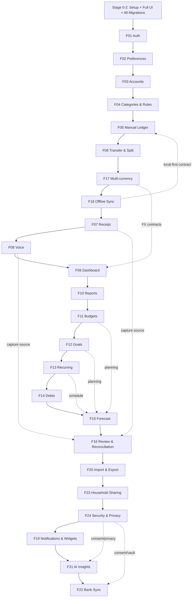

# FinanceApp Feature Dependency Map

> **For agentic workers:** REQUIRED SUB-SKILL: Use `superpowers:subagent-driven-development` (recommended) or `superpowers:executing-plans` to implement this plan task-by-task. Steps use checkbox (`- [ ]`) syntax for tracking.

**Goal:** Menetapkan dependency, urutan topologis, integration edge, dan regression impact seluruh F01–F24 agar implementasi tidak melompat ke consumer sebelum producer stabil.

**Architecture:** Dependency dibagi menjadi foundation contract, hard implementation predecessor, dan downstream consumer. Household/RLS, security, serta sync mempunyai skeleton sejak awal, tetapi user-facing feature tetap ditutup pada urutan eksekusi yang memungkinkan end-to-end verification tanpa rework besar.

**Tech Stack:** Expo/React Native frontend, shared TypeScript domain packages, SQLCipher local data, Supabase schema/RLS/RPC/Storage backend, Jest/pgTAP/Maestro verification.

**Spec:** [`2026-08-24-financeapp-master-task-list.md`](./2026-08-24-financeapp-master-task-list.md), [`2026-08-24-financeapp-sequential-execution-list.md`](./2026-08-24-financeapp-sequential-execution-list.md), dan [`../../features`](../../features).

## Global Constraints

- “Depends on” berarti predecessor harus `DONE`, bukan sekadar migration tersedia.
- Foundation security/household/sync contract boleh dibuat awal, tetapi UI/business feature F18/F23/F24 tetap mengikuti urutan.
- Consumer tidak boleh menyalin domain logic producer; ia mengimpor public interface producer.
- Perubahan public interface setelah consumer aktif memicu regression pada seluruh transitive consumers.
- Edge dinyatakan lulus hanya dengan automated integration test atau device E2E evidence.

---

## 1. Dependency-First Build Graph

Garis penuh adalah urutan eksekusi tunggal. Garis putus-putus adalah integration edge tambahan yang wajib dites saat node tujuan ditutup.

---

## 2. Exact Dependency dan Consumer Matrix

| Order | Feature | Hard predecessors yang harus DONE | Edge yang wajib diuji saat menutup fitur | Consumers yang dibuka |
|---:|---|---|---|---|
| 01 | F01 Auth | Stage 0–2 | OAuth → session → profile/default household; revoked session blocks app | F02, seluruh authenticated routes |
| 02 | F02 Preferences | F01 | Auth user → user-scope preference; locale/currency/timezone injected | F03, all money/date consumers |
| 03 | F03 Accounts | F01, F02 | Household/account RLS; opening balance; restricted account picker | F04, F05, F06, F17 |
| 04 | F04 Categories/rules | F01–F03 | Rule account authorization; category kind consumed by transaction | F05, F07, F08, F11, F13 |
| 05 | F05 Manual transaction | F01–F04 | UI → local tx/outbox → RPC → canonical ledger → local ack | F06, F07, F08, F09, F16 |
| 06 | F06 Transfer/split | F02–F05 | Atomic two-account transfer; fee; split; reversal; rollback | F17, F12, F14 |
| 07 | F17 Multi-currency | F02, F03, F05, F06 | Original vs reporting amount; FX transfer; missing-rate partial state | F09–F15, F20, F22 |
| 08 | F18 Offline sync | F01–F06, F17 | Offline mutation → reconnect → exactly-once ledger; revoke purge | F07–F24 |
| 09 | F07 Receipt | F01–F05, F17, F18 | Local OCR → corrected draft → F05 post → optional private image | F09, F16 |
| 10 | F08 Voice | F01–F05, F17, F18 | Local speech/parser → ambiguity review → F05 post; no server audio | F09, F16 |
| 11 | F09 Dashboard | F03–F08, F17, F18 | Ledger totals, transfer exclusion, fee/refund/reversal, partial access/FX | F10, F11, F15, F19, F21 |
| 12 | F10 Reports | F03–F09, F17 | Same-period parity with dashboard; drill-down authorization | F11, F14, F15, F21 |
| 13 | F11 Budgets | F04, F05, F09, F10, F17, F18 | Category actuals; adjustment; period; threshold event | F13, F15, F19, F21 |
| 14 | F12 Goals | F03, F05, F06, F11, F17, F18 | Split allocation; progress; withdrawal; milestone dedupe | F15, F19, F21 |
| 15 | F13 Recurring | F02–F05, F11, F17, F18 | Versioned schedule → occurrence → match/review → ledger | F14, F15, F19 |
| 16 | F14 Debts | F03, F05, F06, F10, F13, F17 | Ledger-linked payments; report/net-worth parity; no balance source duplicate | F15, F21 |
| 17 | F15 Forecast | F09, F11–F14, F17 | Actual vs planned; source version; permission-scoped low-balance result | F19, F21 |
| 18 | F16 Search/reconciliation | F03–F10, F13, F17, F18 | All source types searchable; duplicate/reconcile; permission revoke | F20, F22 |
| 19 | F20 Import/export | F03–F06, F16–F18 | File → staging → review → atomic ledger; export with authorization hook | F24, F22 |
| 20 | F23 Household sharing | F01, F03–F05, F16, F18, F20 | Invite/role/account permission → aggregate visibility → local purge | F24, F19, all shared views |
| 21 | F24 Security/privacy | F01, F18, F20, F23 | App lock/session/consent/export/delete; shared ownership handling | F19, F21, F22 |
| 22 | F19 Notifications/widgets | F09, F11–F15, F24 | Source event → dedupe scheduler → privacy-safe delivery/deep link | F21; release shell |
| 23 | F21 AI insights | F09–F15, F17, F24 | Consent → authorized aggregate/tool → source explanation; revoke/delete | F22 optional context only |
| 24 | F22 Bank/e-wallet sync | F03–F05, F16–F18, F20, F24 | Provider → staging → reconciliation → exactly-one canonical entry | Final QA |

---

## 3. Kenapa Nomor Feature Tidak Dikerjakan 01–24 Mentah

- **F17 sebelum dashboard/planning:** reporting currency dan missing-rate semantics harus stabil sebelum aggregate dibuat.
- **F18 sebelum receipt/voice:** capture harus memakai local-first post path yang sama; menambah sync belakangan akan menggandakan repository.
- **F20 sebelum F24:** privacy export dan delete flow membutuhkan export-job contract nyata.
- **F23 sebelum F24:** delete account harus memahami sole owner, shared household, transfer ownership, dan retained shared records.
- **F24 sebelum F19/F21/F22:** widget/notification privacy, AI consent, serta provider consent/vault/revoke bergantung pada policy user yang final.
- **F22 terakhir:** integrasi eksternal paling berisiko dan hanya aman setelah ledger, dedupe, reconciliation, consent, and revoke path stabil.

---

## 4. Cross-Feature Integration Gates

### IG01 — Identity dan tenant

`F01 → F02 → F03`

- [ ] Login membuat/reuse profile dan default household tepat sekali.
- [ ] Preference user tidak bocor ke household/user lain.
- [ ] Account create memakai household aktif dan permission helper.

### IG02 — Classification dan ledger

`F03 → F04 → F05 → F06`

- [ ] Authorized account/category picker sama di UI dan server validation.
- [ ] Manual income/expense signs dan category totals valid.
- [ ] Transfer tidak masuk income/expense; fee masuk expense satu kali.

### IG03 — FX dan offline

`F05/F06 → F17 → F18`

- [ ] Offline post/transfer menyimpan original currency dan rate snapshot konsisten.
- [ ] Replay tidak membuat duplicate entry.
- [ ] Missing rate menghasilkan partial state, bukan silent zero.

### IG04 — Capture ke ledger

`F07/F08 → F05 → F09/F16`

- [ ] Receipt dan voice selalu melewati confirmation.
- [ ] Hanya confirmed entry muncul di dashboard/search.
- [ ] Raw OCR/audio/transcript tidak masuk server, log, analytics, atau crash report.

### IG05 — Daily value dan planning

`F09 → F10 → F11/F12/F13/F14 → F15`

- [ ] Dashboard/report/budget/debt totals sama untuk fixture canonical.
- [ ] Planned events tidak dihitung sebagai actual.
- [ ] Forecast menyimpan source version dan menjelaskan partial permission/FX state.

### IG06 — Review dan ingestion

`F16 ← F07/F08/F13/F20/F22`

- [ ] Semua source menggunakan satu review/reconciliation contract.
- [ ] Duplicate resolution dan reconcile finalize idempotent.
- [ ] Restricted account source tidak membocorkan count/preview.

### IG07 — Household authorization

`F23 → F03–F22`

- [ ] Owner/admin/member/restricted/revoked matrix dijalankan terhadap seluruh financial features.
- [ ] Permission downgrade invalidates server query, local cache, widgets, notifications, and snapshots.
- [ ] Deep link ke resource yang baru dicabut menghasilkan generic forbidden/not found.

### IG08 — Security consumers

`F24 → F19/F21/F22`

- [ ] Privacy mode meredaksi dashboard, widget, notification, search preview, recent apps, dan screen reader.
- [ ] Consent revoke menghentikan AI/provider processing dan menjadwalkan retention cleanup.
- [ ] Delete account mencabut provider/device/session sebelum active purge.

### IG09 — External transaction end-to-end

`F22 → F16 → F05 → F09/F10`

- [ ] Provider transaction tetap staging sampai reconcile.
- [ ] Reconcile membuat tepat satu financial entry.
- [ ] Dashboard/report berubah satu kali dan dapat drill down ke sanitized provider provenance.

---

## 5. Change Impact Rules Setelah Fitur DONE

| Producer berubah | Regression minimum yang wajib dijalankan |
|---|---|
| F01/F02 | Seluruh authenticated bootstrap, preferences, deep links, delete/session flows |
| F03 account/permission | F04–F24 permission, aggregate, cache purge, widget/notification privacy |
| F04 classification | F05, F07, F08, F11, F13, F22 mapping |
| F05/F06 ledger | F07–F22 seluruh posting, totals, search, import, reconciliation |
| F17 money/FX | F06, F09–F15, F20, F22 |
| F18 sync/outbox | Semua mutation features dan revoke purge |
| F09/F10 definitions | F11, F14, F15, F19, F21 |
| F11–F14 planning | F15, F19, F21 |
| F16 review/reconcile | F20, F22 |
| F23 roles/permissions | Seluruh server/local read/write/security matrix |
| F24 privacy/consent/delete | F19, F20, F21, F22, release compliance |

Jika regression impact terlalu besar untuk satu perubahan, hentikan dan buat decision record; jangan diam-diam mengubah public contract producer.

